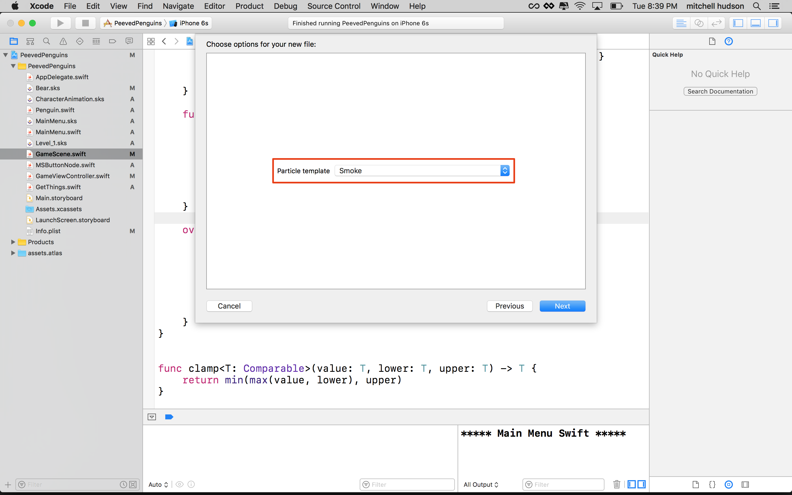

The game is looking good, it would be nice to start adding those little extra touches to enhance the game 
experience. You are going to be adding both a particle effect and sound effect whenever a seal gets 
eliminated. 

Particles are used to create special effects like smoke, fire, rain, explosions, and more. In a nushell, 
a particle system is a large number of small images all animated together as a system. SpriteKit has a 
great integrated particle effect designer which we are going to use to define the style of our first 
particle effect. 

# Creating a new particle effect

> [action]
> Create a new particle effect `File > New > File > SpriteKit Particle File`
>
> 
>
> Choose Smoke from the menu. This is one of the default settings. 
> 
> 
>
> Save this with the name "Poof"
>

Select "Poof" in the project outline on the left. It should look something like this.


I ended up making a more subtle smoke effect. You can copy the property values shown 
or feel free to go crazy and create your own unique look.

> [action]
> Particle attributes:
>
> 
>
> You can use the color ramp to create interesting cycles of color.
>
> 
>

This is what I came up with after playing with the particle settings for a little while. 


Feel free to spend some time playing around with different values.

## Adding the particle effect to our collision

Let's add some code that adds the particle effect to the scene whenever a seal gets 
eliminated.

> [action]
> Add the following code at the start of the `removeSeal` method:
>
```
/* Load our particle effect */
let particles = SKEmitterNode(fileNamed: "Poof")!
/* Position particles at the Seal node */
particles.position = node.position
/* Add particles to scene */
addChild(particles)
let wait = SKAction.wait(forDuration: 5)
let removeParticles = SKAction.removeFromParent()
let seq = SKAction.sequence([wait, removeParticles])
particles.run(seq)
```
>

Here you create an SKEmitter instance using the particle system you configured in "Poof.sks". Then 
add it as a child of this scene, and positioned it at the same position as the Seal. 
Then you set up an action that will remove the `particles` after 5 seconds. 

Note that I set the *Emitter Maximum* to 60 this limits the number of particles produced. 
The wait time needs to be long enough so the emitter can run through the entire life of 
the 60 particles it will emit, then we can remove it. 

# Adding SFX

Adding sound effects is quite straight forward in SpriteKit, you can make use of the `playSoundFileNamed` *SKAction* 
to play sounds.

Download the [SFX Pack](https://github.com/MakeSchool-Tutorials/Peeved-Penguins-SpriteKit-Swift/raw/master/SFX.zip) we
created for you. Once the download is complete, unpack the folder and add
to the project.

Check that the sound you added will be included when you build your app. Select the sound and make use the 
"Target Membership box" has a check. 


> [action]
> Add the following to the `rmeoveSeal()` method:
>
```
/* Play SFX */
let sound = SKAction.playSoundFileNamed("sfx_seal", waitForCompletion: false)
self.run(sound)
```
>

Run the game... Let there be sound!

# Summary

Well done! You learned to:

- Create your own custom particle effects and make them play when certain events in your game occur
- Play SFX

Now you know how to create particle effects and make them play when certain 
events in your game occur.

In the next chapter you will be adding animated penguins to the sidelines.
