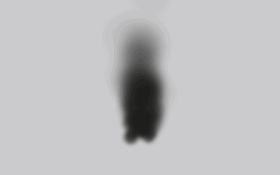
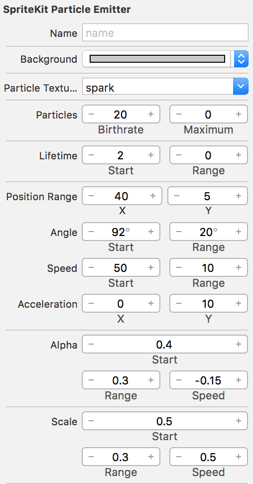
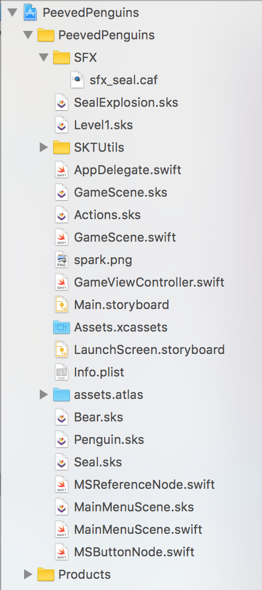

The game is looking good, it would be nice to start adding those little extra touches to enhance the game experience.  You are going to be adding both a particle effect and sound effect whenever a seal gets destroyed. SpriteKit has a great integrated particle effect designer which you are going to use to define the style of your first particle effect.

# Build a particle

> [action]
> Create a new particle effect `File > New > File > SpriteKit Particle File`
>
> Set *Name* to `SealExplosion`
> 
>
> 
>



I ended up making a more subtle smoke effect. You can copy the property values shown or feel free to go crazy and create your own unique look.

> [action]
> Particle attributes:
>
> 
>
> You can use the color ramp to create interesting cycles of color.
>
> 
>

This should look something like that:


Feel free to spend some time playing around with different values.

## Particle effect in code

Let's add some code that adds the particle effect to the scene whenever a seal gets eliminated.

> [action]
> Add the following code to the start of the `dieSeal` method:
>
```
/* Load our particle effect */
let particles = SKEmitterNode(fileNamed: "SealExplosion")!
>
/* Convert node location (currently inside LevelHolder, to scene space) */
particles.position = convert(node.position, from: node)
>
/* Restrict total particles to reduce runtime of particle */
particles.numParticlesToEmit = 25
>
/* Add particles to scene */
addChild(particles)
```
>

You load in a particle effect and place it at the seals's position directly before the seal is removed from the scene. The runtime of the particle can be controlled by adjusting the *numParticlesToEmit*, it takes a bit of trial and error to get a value that looks right.

> [info]
> You can drag the *SealExplosion.sks* into the *GameScene.sks* to see what it looks like in-game, just hit *Animate*.

# Add SFX

Adding sound effects is quite straight forward in SpriteKit, you can make use of the `playSoundFileNamed` *SKAction* to play sounds.

> [action]
> Download our [SFX Pack](https://github.com/MakeSchool-Tutorials/Peeved-Penguins-SpriteKit-Swift/raw/master/SFX.zip)
> Once the download is complete, unpack the folder and add it to the project.
> Ensure *Copy items if needed* is checked.
> 
> **Note:** Although this SFX is an **asset** it's a not a graphic asset so don't put it in the *assets.atlas* folder.

<!-- -->

> [action]
> Add this code after the particle code in the `dieSeal` method:
>
```
/* Play SFX */
let sealSFX = SKAction.playSoundFileNamed("sfx_seal", waitForCompletion: false)
self.runAction(sealSFX)
```
>

Run the game... Bask in the majestic.... Moos? .... of the seal :]

> [challenge]
> Find better SFX.

#Summary

Well done! You learnt to:

- Create your own custom particle effects and make them play when certain events in your game occur
- Play SFX

In the next chapter you will be adding animated penguins to the sidelines.
