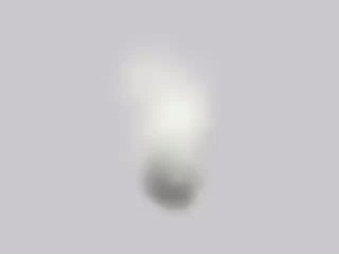

Now we are going to add an Angry Bird style particle effect whenever a seal gets eliminated. SpriteKit has a great integrated particle effect designer which we are going to use to define the style of our first particle effect.

#Create a new particle effect

> [action]
> Create a new particle effect `File > New > File > SpriteKit Particle File`
>
> 
>
> 

Now SpriteKit will open up the *Smoke* particle.


I ended up making a more subtle smoke effect. You can copy the property values shown or feel free to go crazy and create your own
unique look.

> [action]
> Particle atrributes:
>
> 
>
> You can use the color ramp to create interesting cycles of color.
>
> 
>

This should look like this now:




Feel free to spend as much time as you like playing around with different values and options as we will not discuss them in detail now.

#Adding the particle effect to our collision

We are now going to add some code that runs our particle effect whenever a seal gets eliminated.

> [action]
> Add the following code to the start our *didSeal* method:
>
```
/* Load our particle effect */
let particles = SKEmitterNode(fileNamed: "SealExplosion")!
>
/* Convert node location (currently inside Level 1, to scene space) */
particles.position = convertPoint(node.position, fromNode: node)
>
/* Restrict total particles to reduce runtime of particle */
particles.numParticlesToEmit = 25
>
/* Add particles to scene */
addChild(particles)
```
>

The most is explained in the comments of this snippet. We load a particle effect and place it on the seals position directly before we remove the seal from the scene. We control the length of the particle by setting the *numParticlesToEmit*, this takes a bit of trial and error to get a value that looks right.

#Summary

Well done! Now you know how to create particle effects and make them play when certain events in your game occur.
