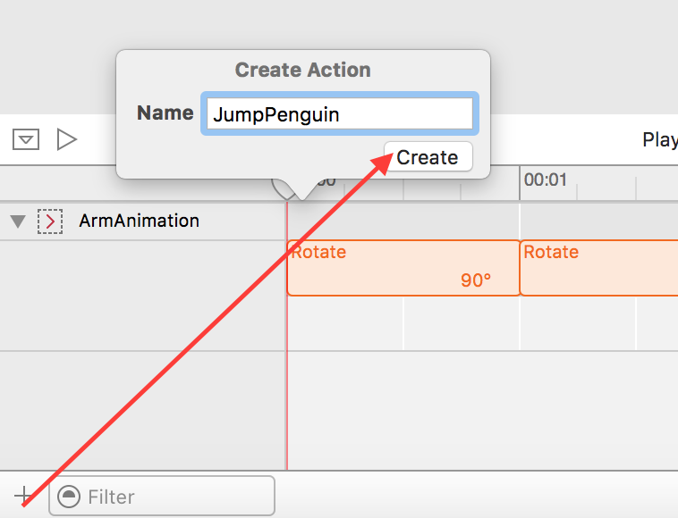

In an early chapter you already learned how to create an animation using the timeline features of SpriteKit (remember the bear?). In this chapter you will learn how to create animations with a series of sprite files. We will animate penguins while the sit around the catapult, waiting to be turned into bullets.

#Penguin animation action

We are going add this new penguin animation action to our *CharacterActions.sks*.

> [action]
> Select your *CharacterActions.sks* and `Add` a new action, call it `JumpPenguin`.
> 
>

##Setup the animation

> [action]
> The first thing we need to is drag in the *AnimateWithTextures* action.
> 

SpriteKit allows you to add animate frames by dropping them into the *Textures* box.

The order for this animation is 1,2,3,2,4,5,6,5,4

> [action]
> Drag in each of the *penguin* frame assets into texture box in order.
> Once you've added the frames, set the *duration* to `2`
> It should look like this when you're finished.
> 
>

Great, you've made a new animation action. Time to apply this to our *GameScene*

#Add Penguins to GameScene

> [action]
> Drag a *waitingpenguin.png* to the *GameScene.sks* and set *Z* to `5`.
> Next scroll down the timeline until you find the penguin and then expand the timeline and add drag in the *JumpPenguin* action.
> We will want to repeat the animation forever so set the action repeat to infinity.
>
> 

#Unsynchronize the animations

The animation looks pretty good - however it seems odd that all penguins perform them at the exactly same moment. This happens because our timeline actions start at zero., which means that the animation starts as soon as the object enters the screen.

We change this really easily, click into each *JumpAction* and simply change the *Start Timer* to `0,0.25 and 0.5`.

Run the game... Looking good.

#Summary

Well done! You now have mastered sprite animations in SpriteKit.

In the next chapter we are going to add those final little touches to round everything off into a more complete game.
