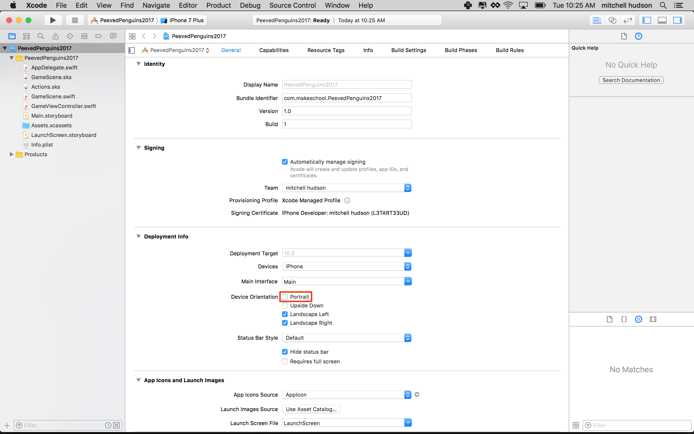
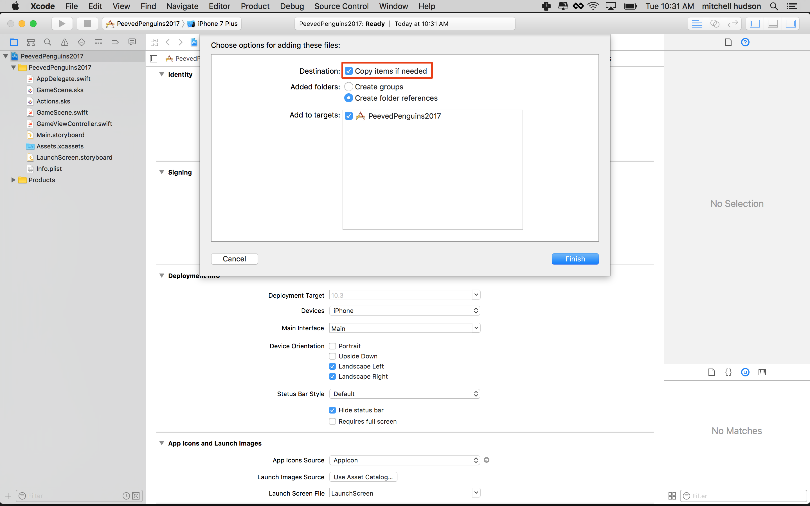

Let's get started with a new SpriteKit project and look at the benefits of using a 
*Texture Atlas*.

# Create a new project

> [action]
> Create a new project in Xcode named `PeevedPenguins`, set the *Language* to `Swift` 
> and *Game Technology* is set to `SpriteKit`.
> 
>

## Landscape

Now download the [Peeved Penguins art pack](https://github.com/MakeSchool-Tutorials/Peeved-Penguins-SpriteKit-Swift/raw/master/PeevedPenguinsAssets.zip) we created for you. Once the download is complete, unpack the folder.

This game will use the landscape device orientation, you need to set this in the project 
otherwise it will default to portrait.

> [action]
> Click on your project (the top item in the *Project Navigator*)
> On the next screen, click on the *PeevedPenguins* target, ensure you are in the *General* tab and then uncheck the *Portrait* option as shown:
> 
>

# Download assets

> [action] Now download the [Peeved Penguins art pack](../PeevedPenguinsAssets.zip) we 
> created for you. Once the download is complete, unpack the folder.

# The Texture Atlas

The unpacked folder should be named `assets.atlas` the key here is the extension `.atlas`.  This lets Xcode know you want these assets to be converted into a *Texture Atlas*.  You will have noticed all of the assets use the '@2x' suffix to let Xcode know these are 2x retina assets.

> [info]
> What is a *Texture Atlas*? I'm glad you asked.
> In the Hoppy Bunny tutorial you added single assets to the project using 
> `Assets.xcassets` this gives us great control over the assets however it is inefficient 
> when it comes to game rendering performance.
>
> Imagine opening up your preferred image editing software and copy/pasting all of these 
> single images into one larger image to hold them all. The immediate benefit would be 
> instead of the app having to load in approx 25 png files it now only has to load one.  
> On today's devices this is a relatively small win. However, only a few iPhone 
> generations ago this alone could give a nice little improvement to the loading time. 
> Every second counts when it comes to holding your players attention.
>
> The bigger benefit is realized during the rendering of the  game scene. Every time 
> (ideally 60 times per second) your *Assets* (or *Sprites*) need to be displayed on 
> screen, the rendering engine must go to texture memory where the sprite is stored and 
> render this into the frame buffer.  There is a performance cost to switching textures, 
> this can be negated by the use of the *Texture Atlas*, instead of having to switch 
> textures 25 times, 60 times a second.  The rendering engine can now render 25 different 
> sections from *one* texture to render the scene and improve performance! You will find 
> a *Texture Atlas* may also be referred to as a *Sprite Sheet*.

Time to import our assets.

> [action]
> Drag the `assets.atlas` folder into your project.
> Ensure `Copy items if needed` and `Create groups` are checked.

**Where is this big texture exactly?**

Xcode will generate a *Texture Atlas* from all of the assets in the new folder when the 
project is built.

# Summary

Xcode makes it very easy to create a *Texture Atlas* or *Sprite Sheet*, this simple 
technique is very effective in improving game performance and you should always use it 
in any scene with more than a few assets.

In the next chapter you will learn to use the timeline and animate game objects.
