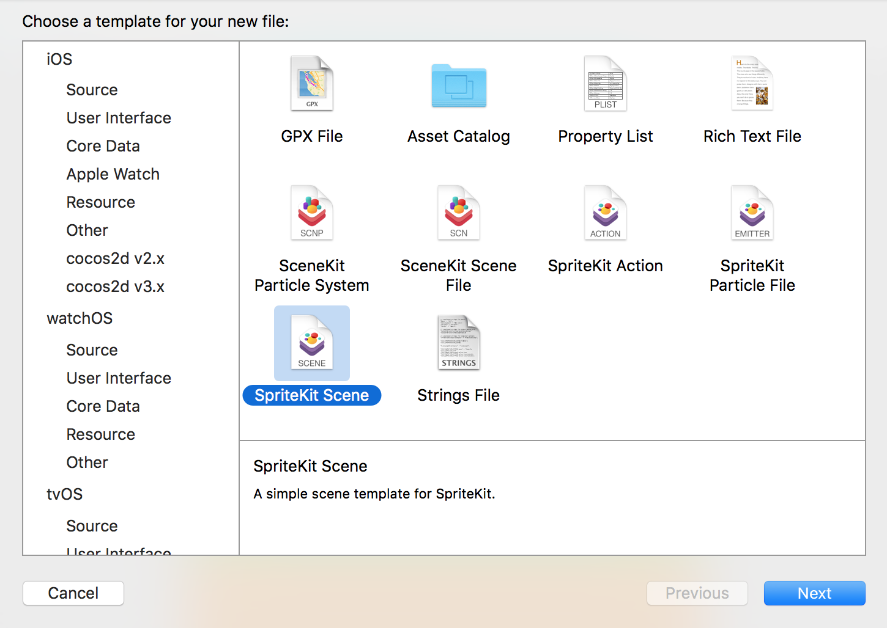

Let's learn how to create animations with SpriteKit's timeline. You are going to add a taunting animation to the bear that will sit behind our catapult:

#Build a bear

The bear will have it's own `.sks` file.

> [action]
> Create a new file called *Bear.sks* (`File > New > File`) in your project:
>
> 

You need to combine two images to make the bear, the body without an arm and a separate arm that will then be animated.

> [action]
> Select *Bear.sks* and `Zoom Out` the scene so you can see the yellow border.
> Drag *bearnoarms.png* in from your *Media Library* to the scene, I recommend you use **snap** to snap the *bearnoarms.png* to the bottom left corner of the scene.
>
> 

<!--  -->

> [info]
> To use node snapping, you need to hold *Shift* while dragging your objects as of Xcode 7.2.1

<!--  -->

> [action]
> Add *bearnoarms.png* and set the *Anchor Point* to `(0,1)`, position it somewhere that looks sensible.
> Set the *Z* to `1` to ensure the arm is always on top of the body.
>
> 

You need to set the anchor point of the arm because we are going to rotate it. When you apply a rotation to a *SKNode* it will rotate around the anchor point - for the arm, this should ideally be somewhere near the shoulder, which in this case is the top left corner of the image.

> [info]
>If you are wondering why the yellow scene size border is different than yours, I like to set the scene size to fit nicely around the content, so in this case I would set the scene to be the same size as the *Bear*.
> It doesn't really matter for the bear as it's static content.  However, it does for other objects like the ?penguin which I will discuss later.

#Adding animation

Now you can animate the polar bear's arm. In SpriteKit there is a default **Timeline** for adding animation actions.  However, you are going to use a more powerful feature and create shared animations, which are stored in a *SpriteKit Action* file, this gives you the power to reuse the custom animations your create with any node.

> [action]
> Click on *+* to add a new timeline and name it `ArmAnimation`, when prompted to create a new file name it `CharacterActions.sks`.
>
> 
>

##Adding actions to the timeline

You will be animating the arm using two rotation actions, the first one will *rotate* the arm by `90` degrees and the second will *rotate* it back by `90` degrees.  Unfortunately SpriteKit doesn't allow you to easily preview this animation when building shared **timeline** actions.

> [action]
> You should be in *CharacterActions.sks*, expand *ArmAnimation* and locate the *Rotate* action in the *Object library*.
> Drag this into the timeline, the default values of *Duration* `1` and *Degrees* `90` works well.
> Drag another rotation in and set the *Degrees* to `-90`
>
> 
>

Congratulations! Let's try this out on the Bear.

##Applying custom actions

> [action]
> Open *Bear.sks*, have a look in your *Object Library* you should see your custom action `ArmAnimation`.
> Drag this into the timeline for the arm, ensure the duration is `00:02` by dragging the edge of the action bar or set *Duration* to `2`
>
> 
>
> Next you will want to ensure this animation loops forever, click on the **loop** symbol in the bottom-left of your **ArmAnimation** action and highlight the infinity symbol.
>
> 
>

Great job, time to press *Animate* at the top of the timeline editor and your bear should hopefully look like this:

#Summary

You've learnt to:

- Create a new SpriteKit Scene for the bear
- Create a custom `ArmAnimation` action in a shared SpriteKit Action file
- Apply your custom action to the bear timeline

In the next chapter you will be creating more game objects, ready for use in the game.
