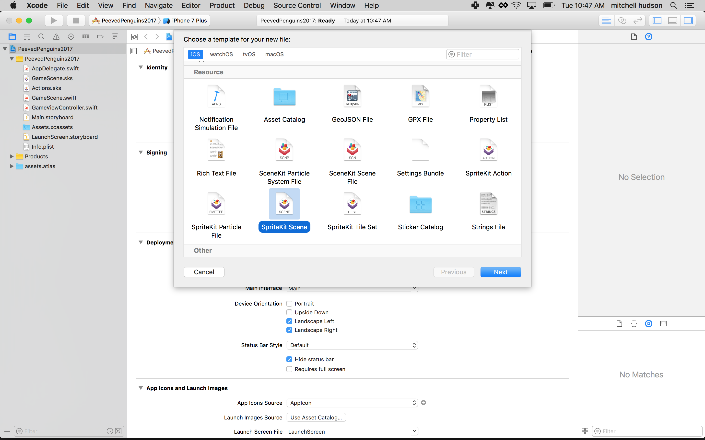
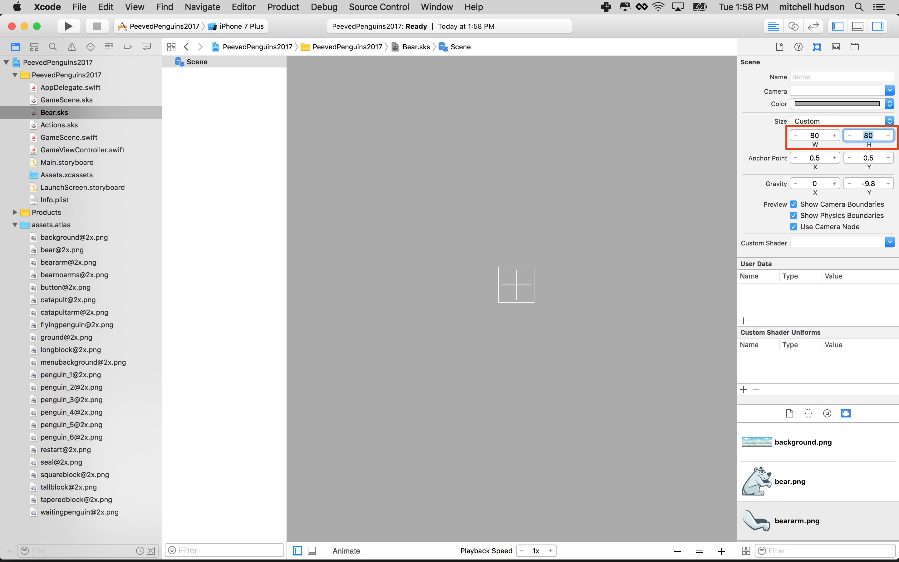
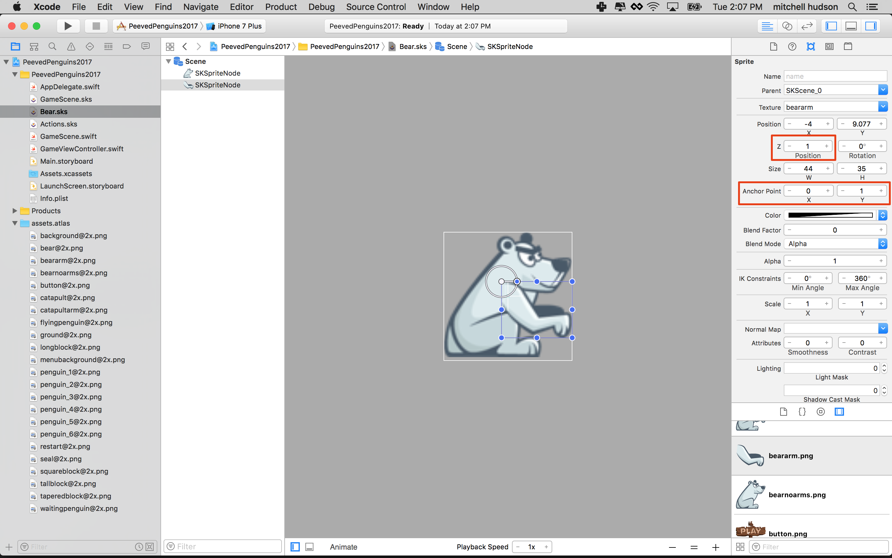
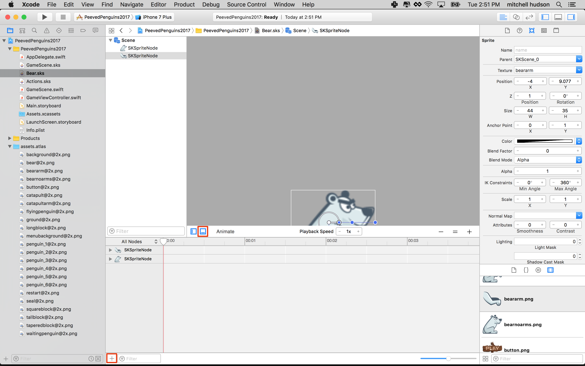
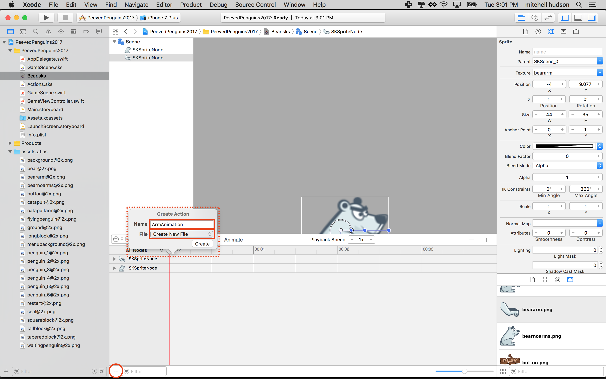
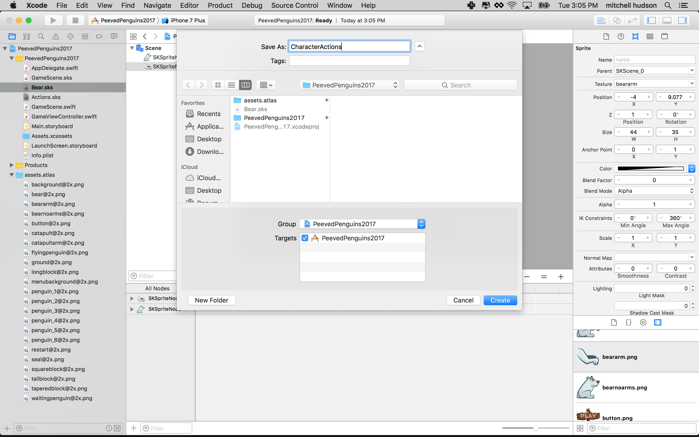
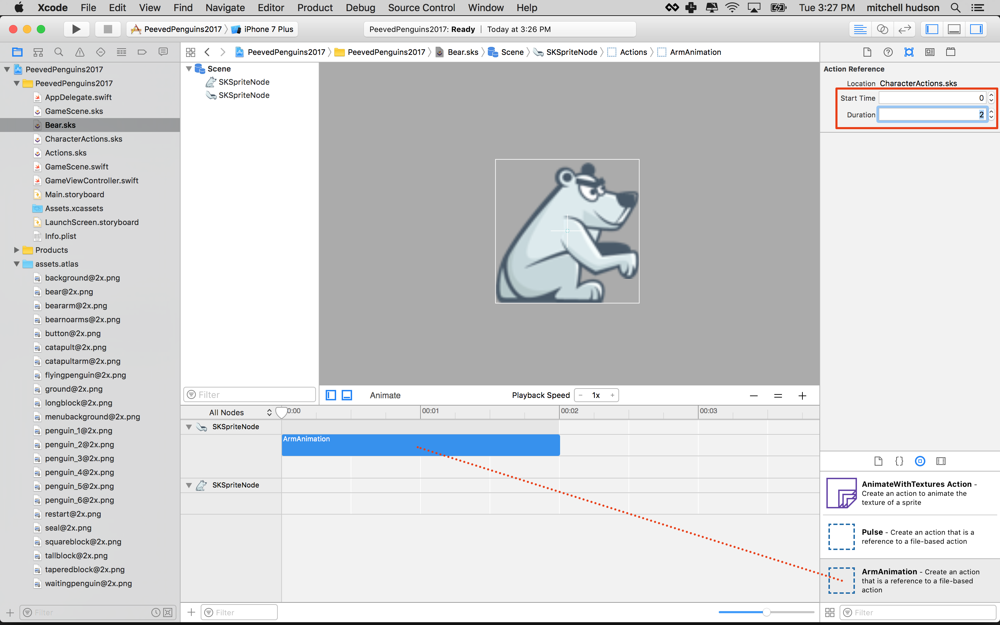

Let's learn how to create animations with SpriteKit's timeline. You are going to add a 
taunting animation to the bear that will sit behind our catapult:

# Build a bear

The bear will have it's own `.sks` file.

> [action]
> Create a new file called *Bear.sks* (`File > New > File`) in your project:
>
> 

You need to combine two images to make the bear, the body without an arm and a separate 
arm that will then be animated.

<!--  -->

> [action]
> Resize the content of this view. Set the Height and width of the Bear scene to 
> 80 x 80.
>
> Select *Bear.sks* and `Zoom Out` the scene so you can see the yellow border.
> Drag *bearnoarms.png* in from your *Media Library* to the scene, **snap** it to the bottom left corner of the scene.
>
> 
>

Show the Media Library in the lower right by clicking the small Film icon. 

> [action]
> Select *Bear.sks* and `Zoom Out` the scene so you can see the white border.
> Drag *bearnoarms.png* in from your *Media Library* to the scene, snap it to snap the 
> bottom left corner of the scene.
>
> 
>

> [info]
> The Bear doesn't snap to the lower corner choose Editor > Snap to Nodes. 
>

> [action]
> Add *beararm.png* and set the *Anchor Point* to `(0,1)`, position it somewhere that looks sensible.
> Set the *Z* to `1` to ensure the arm is always on top of the body.
>
> 

You need to set the anchor point of the arm because we are going to rotate it. When you 
apply rotation to a *SKNode* it will rotate around the anchor point - for the arm, this 
should ideally be somewhere near the shoulder, which in this case is the top left corner 
of the image.

# Adding animation

Now you can animate the polar bear's arm. In SpriteKit there is a default **Timeline** for adding animation actions.  However, you are going to use a more powerful feature and create shared animations, which are stored in a *SpriteKit Action* file, this gives you the power to reuse the custom animations you create with any node.

> [action]
> Open the timeline then click on *+* to add a new timeline and name it `ArmAnimation`, 
> when prompted to create a new file name it `CharacterActions.sks`.
> 
>
> 
> 
> 

## Adding actions to the timeline

You will be animating the arm using two rotation actions, the first one will *rotate* the 
arm by `90` degrees and the second will *rotate* it back by `90` degrees. Unfortunately 
SpriteKit doesn't allow you to easily preview this animation when building shared 
**timeline** actions.

> [action]
> You should be in *CharacterActions.sks*, expand *ArmAnimation* and locate the *Rotate* 
> action in the *Object library*.
> Drag this into the timeline, the default values of *Duration* `1` and *Degrees* `90` 
> works well.
> Drag another rotation in and set the *Degrees* to `-90`
>
> 
>

Congratulations! Let's try this out on the Bear.

## Applying custom actions

> [action]
> Open *Bear.sks*, have a look in your *Object Library* you should see your custom action 
> `ArmAnimation`.
> Drag this into the timeline for the arm, ensure the duration is `00:02` by dragging the 
> edge of the action bar or set *Duration* to `2`.
> 
> **NOTE!** you may not see the animation appear on the timeline if the duration, in 
> the upper right, is 0! Setting the duration to a value greater than 0 will make the 
> animation appear on the timeline. 
>
> 
>
> Next you will want to ensure this animation loops forever, click on the **loop** symbol 
> in the bottom-left of your **ArmAnimation** action and highlight the infinity symbol.
>
> 
>

Great job, time to press *Animate* at the top of the timeline editor and your bear should 
hopefully look like this:

# Summary

You've learnt to:

- Create a new SpriteKit Scene for the bear
- Create a custom `ArmAnimation` action in a shared SpriteKit Action file
- Apply your custom action to the bear timeline

In the next chapter you will be creating more game objects, ready for use in the game.
