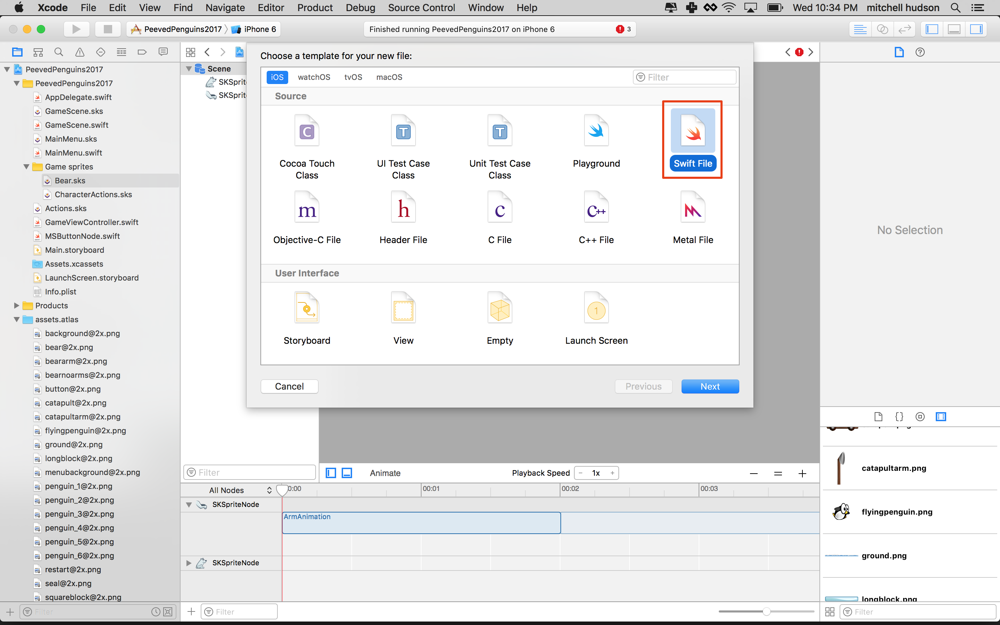

# Game Objects 

In this lesson you will create some game objects that will be used 
by your game. Here you will create classes that generate instances
of these objects configured for the game to use. 

# Penguin

> [action]
> Create a new Swift file by choosing: File > New > File... Then choose
> Swift as the file type. Name the file: "Penguin" and save. 



You will now add some code to create a new sprite and set the options to 
give that sprite the behavior that you want for your game. 
 
> [action]
> Add the following code to Penguin.swift. 
>
```
import SpriteKit
>
class Penguin: SKSpriteNode {
>    
    init() {
        // Make a texture from an image, a color, and size 
        let texture = SKTexture(imageNamed: "flyingpenguin")
        let color = UIColor.clear
        let size = texture.size()
 >       
        // Call the designated initializer
        super.init(texture: texture, color: color, size: size)
 >       
        // Set physics properties
        physicsBody = SKPhysicsBody(circleOfRadius: size.width / 2)
        physicsBody?.categoryBitMask = 1
        physicsBody?.friction = 0.6
        physicsBody?.mass = 0.5
    }
>
    required init?(coder aDecoder: NSCoder) {
        fatalError("init(coder:) has not been implemented")
    }
}
```
> You will also want to be alerted when the seal is involved in a collision with the penguin so you set the *Contact Mask* 
> to `1`.
>

Here you made a new Swift file, and defined a class named: Penguin. The Peguin class
sub classes the SKSpriteNode class. SpriteNodes are game objects. The Penguin sprite
has a texture, color, and size. These determine how the sprite appears on the screen. 

The game will use a physics simulation to move objects on the screen. You added a 
physics body to the Penguin, and set some properties on the body to determine how the 
Penguin will interact with other object in the simulation.

# Summary

Here you defined a class from which you can generate Penguin objects. The Penguin
is a subclass of SKSpriteNode. Sprite Nodes are a common component of sprite kit. 
Sprites are game objects that you see on the screen. They have properties of: 
texture, color, size, and physicsBody.  

In this section you've learned:

- How to create a new class
- Define an initializer for that class. 
- Create a texture.
- Create a physics body. 

You learned to:

- Create reusable core game objects
- Setup physics properties and tweak values
- Use a custom class for the scene


