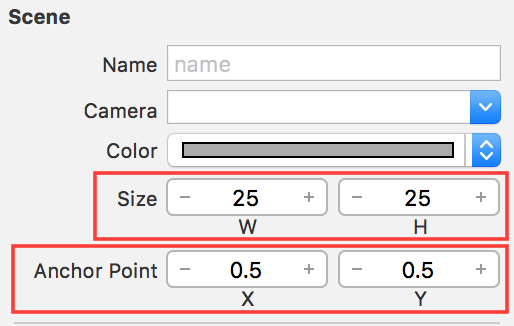
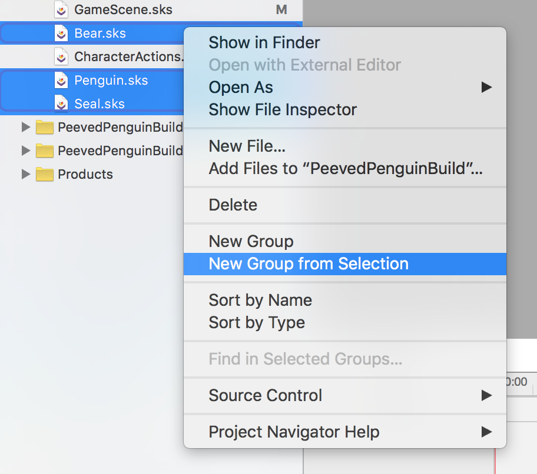

Seals are the bad guys in Peeved Penguins. The goal is to get rid of all of them! You shoot penguins at them to get rid of them.

Next, we want to create the Seal and Penguin objects in SpriteKit.

#Penguins

Let's start with the penguins. We want penguins and seals to each get their own .sks files because they are going to be reusable objects in the game scene.  We will be creating them in the Scene Editor and in code.

> [action]
> Create a new SKS file (`File > New > File > SpriteKit Scene`) and name it `Penguin.sks`.
>
> Next drag in the `flyingpenguin.png` asset to the new scene, I would recommend setting the *Scene Size* to `(25,25)` which is the size of the `flyingpenguin.png` asset and setting the *Anchor Point* of the scene to `(0.5,0.5)`.  
>
> 
>
> You can then *Hold Shift* and snap the penguin to the center of the scene.
>
> 

The penguin is nearly ready for prime time, this is a physics based game so the penguin will need to be physics enabled.  If you look at the shape of the penguin it's practically a ball.... The perfect physics projectile body :]

#Penguin physics

> [action]
> Ensure the penguin is selected and set the *Physics Definition* as shown:
>
> 
>
> We're increasing the *Friction* to `0.6` although the penguin will be smashing into ice blocks we want to ensure it doesn't slide around too much.  There is always a balance between realism and fun.
> The *Mass* has been increased to `0.50` as the penguin will act as more of a cannon ball than a fluffy penguin.
> We will set the *Category Mask* to `1` as our first physics group. This was discussed in more detail in the *Hoppy Bunny Tutorial*.
>

<!-- -->

> [info]
> You may wonder, where did these values come from?
> Trial and error :] The key to physics simulation is tweaking values, don't worry it's a normal part of game development for physics based games. Getting the balance so the game has the right feel.

#Accessing the penguin

There is one not so obvious issue we need to deal with, if we drag our penguin into the *GameScene* a *SKReferenceNode* will be created, it's important to note this is a reference to the *Penguin.sks* scene and not the penguin sprite itself.  However, we need to be able to easily access the penguin's physics body.

Thankfully we've already created a handy sub-class of *SKReferenceNode* that lets us access this more easily.

> [action]
> [Download MSReferenceNode.swift](https://raw.githubusercontent.com/MakeSchool-Tutorials/Peeved-Penguins-SpriteKit-Swift-Solution/master/PeevedPenguin/MSReferenceNode.swift) and add it to your project.  Feel free to explore the code, it's short and sweet :]

We will be making use of the class in later chapters, it's important to set the name of the sprite we require access to so let's do
this now:

> [action]
> Click on the penguin and set the *Name* property to `avatar`
> We will come back to this later.

Time to add the bad guys! The process of creating the seal will be very similar to that of the Penguin.

#Seals

The process to add our cute but evil seal's is very similar to the penguin.

> [challenge]
> See how far you can get setting up *Seal.sks* with out looking at the steps below :]
>

<!-- -->

> [action]
> Create a new SKS file (`File > New > File > SpriteKit Scene`) and name it `Seal.sks`.
>
> Next drag in the `seal.png` asset to the new scene, I would recommend setting the *Scene Size* to `(27,25)` which is the size of the seal asset and setting the *Anchor Point* of the scene to `(0.5,0.5)`.  
>

##Seal Physics

Imagine the seal is like a pin in ten-pin Bowling and the penguin is like a bowling ball.

> [action]
> Time to setup the physics body, the default values are pretty close to what we want, the only real difference being we
> need to set a *Category Mask* and *Contact Mask*.
>
> Ensure the seal is selected and set the *Physics Definition* as shown:
> 
>
> Our penguin has taken the first *Category Mask* of `1` so the next category we can use will be `2` for the seal.
>
> You want to be alerted when the seal is involved in a collision with anything so you set the *Contact Mask* to `1`.
>

That's it! You now have some reusable game objects ready to use.

#Organization

Now that you have a few game files, it's a good idea to keep your *Project navigator* organized.
I would suggest moving the new game objects into their own *Group* as shown:

Call it whatever helps you relate :] These groups are virtual organization and do not affect your file structure.

#Summary

You learnt to create reusable core game objects and modify physics properties to fine tune the desired result of your physics simulation.
In the next chapter you will be building the essential *Main Menu Screen*.
