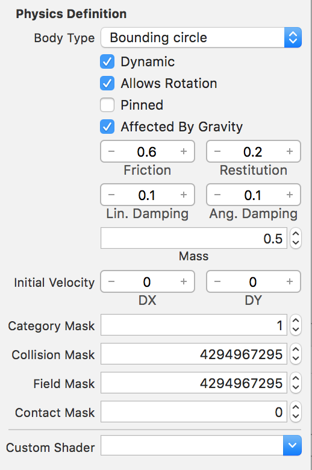
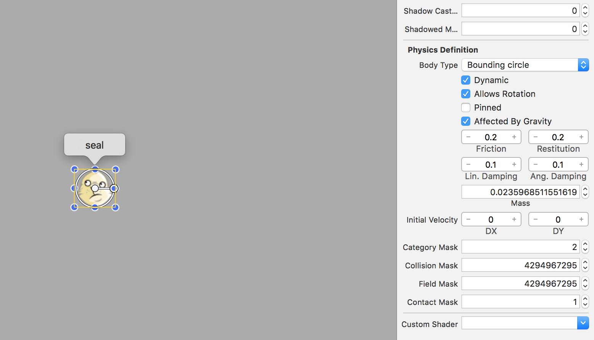

Seals are the big bad in the Peeved Penguins world. The goal is to crush all of them! You catapult penguins into their to try and crush them.

Your next step is to create the Seal and Penguin objects.

# The Penguin

The penguins and seals will need get their own *SKS* files as they will be reusable game objects in the game scene.  You will be adding them in both the Scene Editor and directly in your code.

> [action]
> Create a new SKS file (`File > New > File > SpriteKit Scene`), set *Name* to `Penguin.sks`.
>
> Drag the *flyingpenguin.png* asset into scene from the *Media Library*.
> Set the *Scene Size* to `Custom - (25,25)`, this matches the *Size* of the *flyingpenguin.png*.
>
> Snap the penguin to the center of the scene.
>
> 
>

The penguin is nearly ready for action, this will be a physics based game so the penguin will need to be physics enabled.  If you look at the shape of the penguin it's nearly a ball.... The perfect physics projectile body :]

## Enabling physics

> [action]
> `Select` the penguin and scroll through the *Attributes inspector*, until you find the **Physics Definition** section.
>
> Set *Body Type* to `Bounding Circle`, this will open up the additional physics attributes to work with.
> Set *Friction* to `0.6`, although the penguin will be smashing into ice blocks you want to ensure it doesn't slide around too much.  There is a fine balance between realism and fun.
> Set *Mass* to `0.50` as the penguin should act as more of a cannon ball than a fluffy ball of fur.
> Set *Category Mask* to `1` as this will be the first physics group in the simulation.
>
> 

For additional information relating to *Physics Masks* please see
@TODO BE BINCE TO HAVE A COOL PHYSICS MASK PLAYGROUND TO LINK TO

<!-- -->

> [info]
> You may wonder, where did these values come from? Did I run the simulation in my head? No...
>
> Trial and error, the key to a fun physics simulation is lots of tweaking. Don't worry it's a normal part of game development. Getting the balance right can be the difference between great and mediocre.

## Accessing the penguin

There is one not so obvious issue you need to deal with. If you drag the penguin into the *GameScene* an *SKReferenceNode* will be created, it's important to note this is a reference to the *Penguin.sks* scene, **NOT** the penguin *SKSpriteNode*.  However, you need to be able to access the penguin's physics body to apply physics forces to it.

Thankfully we've already created a handy sub-class of *SKReferenceNode* called *MSReferenceNode* that will let you access the penguin *SKSpriteNode* inside the penguin scene.

> [action]
> [Download MSReferenceNode.swift](https://github.com/MakeSchool-Tutorials/Peeved-Penguins-SpriteKit-Swift-Solution/raw/master/PeevedPenguinBuild/MSReferenceNode.swift) and add it to your project. As always have a sneaky peek at the code.  You will be making use of the class in later chapters.

It's important to set the *Name* of the *SKSpriteNode* in the scene you require access to, in this case it is the penguin.

> [action]
> `Click` on the penguin and set *Name* property to `avatar`
> 

Great job, time to add those evil seals! The process of creating the seal will be nearly identical to that of the Penguin.

# The seal

> [challenge]
> See how far you can get on your own.
>

<!-- -->

> [action]
> Create a new SKS file (`File > New > File > SpriteKit Scene`) and name it `Seal.sks`.
>
> Drag in the *seal.png* asset to the scene.
> Select the scene and *Size* to `Custom - (27,25)`.
> Set *Anchor Point* to `(0,0)`
>

## Enabling physics

It's often handy to think about your game physics in real terms, imagine the seal will act like a pin in ten-pin Bowling and the penguin will act as the bowling ball.

> [action]
> `Select` the penguin and scroll through the *Attributes inspector*, until you find the **Physics Definition** section.
>
> Set *Body Type* to `Bounding Circle`, this will open up the additional physics attributes to work with.
> Set *Category Mask* to `2` as this will be the second physics group in the simulation.
> Set *Contact Mask* to `1` as you want to be notified in code when a seal is involved in a collision
>
> 

That's it! You now have all the reusable game objects ready to add to your game scene.

# Summary

You learnt to:

- Create reusable game objects
- Enable physics bodies and tweak properties
- Think about your game physics simulation in real world terms

In the next chapter you will be building the first thing the player typically sees in any game, the main menu.
