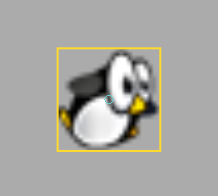

# Game Objects 

In this lesson you will create some game objects that will be used 
by your game. Here you will create classes that generate instances
of these objects and configured for the game. 

<<<<<<< HEAD
# Penguin 
=======
#Creating the penguin scene

The penguins and seals will each get their own *SKS* files as they will reusable objects in the game scene.  You will be using them in both the Scene Editor and in your code.

> [action]
> Create a new SKS file (`File > New > File > SpriteKit Scene`) and name it `Penguin.sks`.
>
> Drag the *flyingpenguin.png* asset into scene, set the *Scene Size* to `(25,25)` which is the size of the *flyingpenguin.png* asset and set the *Anchor Point* of the scene to `(0.5,0.5)`.  
>
> 
>
> Snap the penguin to the center of the scene.
>
> 
>

The penguin is nearly ready for action, this is a physics based game so the penguin will need to be physics enabled.  If you look at the shape of the penguin it's practically a ball.... The ideal physics projectile body :]

##Enabling physics

> [action]
> Click on the penguin and set the *Physics Definition*:
>
> 
>
> You're setting the *Friction* to `0.6` although the penguin will be smashing into ice blocks you want to ensure it doesn't slide around too much.  There is always a fine balance between realism and fun.
> The *Mass* has been increased to `0.50` as the penguin should act as more of a cannon ball than a fluffy penguin.
> The *Category Mask* is set to `1` as this will be the first physics group.

For more information relating to *Physics Masks* please see the *Hoppy Bunny Tutorial*.

<!-- -->

> [info]
> You may wonder, where did these values come from? Did I run the simulation in my head?
>
> Trial and error, the key to a fun physics simulation is lots of tweaking. Don't worry it's a normal part of game development. Getting the balance right can be the difference between great and mediocre.

##Accessing the penguin

There is one not so obvious issue you need to deal with, if you drag the penguin into the *GameScene* an *SKReferenceNode* will be created, it's important to note this is a reference to the *Penguin.sks* scene and not the actual penguin sprite itself.  However, we need to be able to easily access the penguin's physics body for use with the launcher.

Thankfully we've already created a handy sub-class of *SKReferenceNode* called *MSReferenceNode* that will let you access the penguin sprite inside the penguin scene.

> [action]
> [Download MSReferenceNode.swift](https://github.com/MakeSchool-Tutorials/Peeved-Penguins-SpriteKit-Swift-Solution/raw/master/PeevedPenguinBuild/MSReferenceNode.swift) and add it to your project. As always have a peek at the code.

You will be making use of the class in later chapters, it's important to set the *Name* of the sprite in the scene you require access.

> [action]
> Click on the penguin and set the *Name* property to `avatar`

More on this later.

Time to add the bad guys! The process of creating the seal will be very similar to that of the Penguin.

#Creating the seal scene

The process to add our cute but evil seals is very similar to the penguin.

> [challenge]
> See how far along you can get setting up the *Seal.sks*, no peeking at the solution :]
>

<!-- -->
>>>>>>> MakeSchool-Tutorials/master

> [action]
> Create a new Swift file by choosing: File > New > File... Then choose
> Swift as the file type. Name the file: "Penguin" and save. 


You will now add some code to create a new sprite and set the options to 
give that sprite the behavior that you want for your game. 
 
> [action]
> Add the following code to Penguin.swift. 
>
```
import SpriteKit
>
class Penguin: SKSpriteNode {
>    
    init() {
        // Make a texture from an image, a color, and size 
        let texture = SKTexture(imageNamed: "flyingpenguin")
        let color = UIColor.clear
        let size = texture.size()
 >       
        // Call the designated initializer
        super.init(texture: texture, color: color, size: size)
 >       
        // Set physics properties
        physicsBody = SKPhysicsBody(circleOfRadius: size.width / 2)
        physicsBody?.categoryBitMask = 1
        physicsBody?.friction = 0.6
        physicsBody?.mass = 0.5
    }
>
<<<<<<< HEAD
    required init?(coder aDecoder: NSCoder) {
        fatalError("init(coder:) has not been implemented")
    }
}
```
=======
> You will also want to be alerted when the seal is involved in a collision with the penguin so you set the *Contact Mask* to `1`.
>>>>>>> MakeSchool-Tutorials/master
>

Here you made a new Swift file, and defined a class named: Penguin. The Peguin class
sub classes the SKSpriteNode class. SpriteNodes are game objects. The Penguin sprite
has a texture, color, and size. These determine how the sprite appears on the screen. 

The game will use a physics simulation to move objects on the screen. You added a 
physics body to the Penguin, and set some properties on the body to determine how the 
Penguin will interact with other object in the simulation.

# Summary

Here you defined a class from which you can generate Penguin objects. The Penguin
is a subclass of SKSpriteNode. Sprite Nodes are a common component of sprite kit. 
Sprites are game objects that you see on the screen. They have properties of: 
texture, color, size, and physicsBody.  

In this section you've learned:

- How to create a new class
- Define an initializer for that class. 
- Create a texture.
- Create a physics body. 

<<<<<<< HEAD
=======
You learnt to:

- Create reusable core game objects
- Setup physics properties and tweak values
- Use a custom class for the scene
>>>>>>> MakeSchool-Tutorials/master

