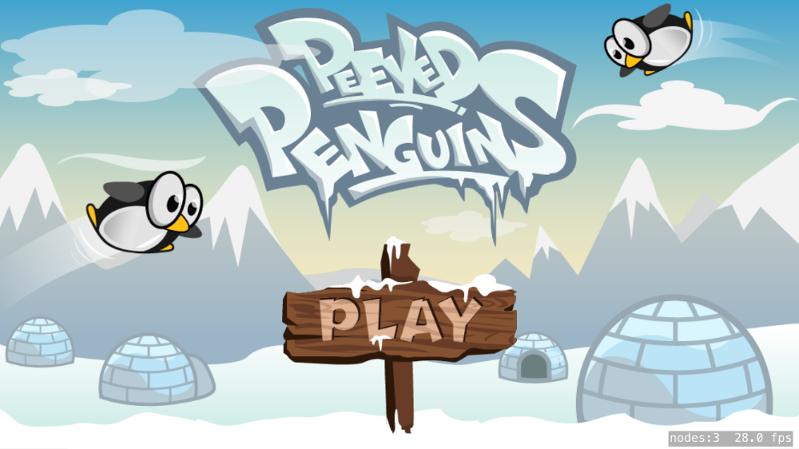

Now we are going to setup the games main menu screen. That start menu will lead us to the gameplay scene that we will develop in the next chapter.

#Main Scene

We are going to create a MainScene for out main menu.

> [action]
> Create a new SKS file (`File > New > File > SpriteKit Scene`) and name it `MainMenu.sks`
> Set the main menu *Scene Size* to `(568,320)`
> 

The artwork provided was designed for 2x retina screens, 568 x 320 corresponds to using the iPhone 5 as the design resolution
for our scene.

##Adding the background

> [action]
> Drag *menubackground.png* to the screen and snap to the bottom-left corner.
> Set the *Z* property to `-1` to ensure our background is always in the background :]

#Add the play button

Our main menu needs a play button to trigger a transition into the GameScene.

> [action]
> SpriteKit does not have any direct for buttons, so we will need to use our own as we did in the *Hoppy Bunny Tutorial*.
> Drag *button.png* into the scene, place it wherever looks good to you.
> We will need to create a code connection to link this button to our code so set the *Name* of this sprite to `buttonPlay`, we will
> also need to set a *Custom Class* of `MSButtonNode` as shown:
>
> 
>

If you improved the *MSButtonNode* class in the *Hoppy Bunny Tutorial* and made it awesome.  Please feel free to reuse it in this project.
Otherwise...

> [action]
>  and drag this file into your project, ensuring *Copy items if needed* is ticked.

Now run the project....

#Setting the default scene

Where's my shiny new menu? Well we need to tell SpriteKit which scene to launch.

> [action]
> Take a look through the `GameViewController.swift` and you will see this line:
>
```
if let scene = GameScene(fileNamed:"GameScene") {
```
> Change this to:
```
if let scene = GameScene(fileNamed:"MainScene") {
```

Run your project, you should see your main menu!

> 

Looks good, you can even click the button.  However, it doesn't do anything other than print out the following in the debug console:

> 

Let's create a new *MainScene* class we can use to facilitate our button's code connection.

> [action]
> Create a new empty Swift file (`File > New > File > Swift File`) and name it `MainScene.swift`
> Ensure your new class reads as follows:
>
```
import SpriteKit
>
class MainScene: SKScene {
>    
    /* UI Connections */
    var buttonPlay: MSButtonNode!
>    
    override func didMoveToView(view: SKView) {
        /* Setup your scene here */
>        
        /* Set UI connections */
        buttonPlay = self.childNodeWithName("buttonPlay") as! MSButtonNode
>        
        /* Setup restart button selection handler */
        buttonPlay.selectedHandler = {
>            
            /* Grab reference to our SpriteKit view */
            let skView = self.view as SKView!
>          
            /* Load Game scene */
            let scene = GameScene(fileNamed:"GameScene") as GameScene!
>            
            /* Ensure correct aspect mode */
            scene.scaleMode = .AspectFill
>            
            /* Show debug */
            skView.showsPhysics = true
            skView.showsDrawCount = true
            skView.showsFPS = true
>            
            /* Start game scene */
            skView.presentScene(scene)
        }
>
    }
>
}
```
>

This code creates the code connection for our button and sets up a handler to switch to our *GameScene* when the button is touched.
We need to make sure we are instantiating the *MainScene* class, let's make that change.

> [action]
> Switch back to `GameViewController.swift`, remeber this line:
>
```
if let scene = GameScene(fileNamed:"MainScene") {
```
> Change this to:
>
```
if let scene = MainScene(fileNamed:"MainScene") {
```
>

Run the project... You should now be able to click the **Play** button and be presented with a blank grey screen :]

#Summary

You learnt the basics of implementing multiple scenes by creating that all important main menu scene and the accompanying scene class. You also learnt how to change the default scene in your game.

In the next chapter you will start building the game scene.
