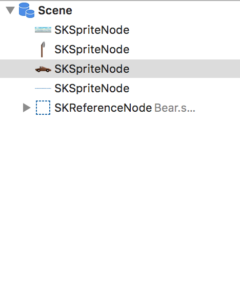
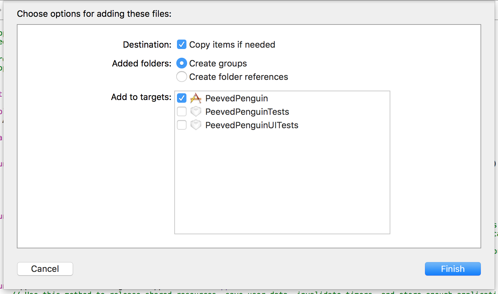

Now it's time to start working on the good stuff, you're going to construct the first version of your *Penguin Launcher*

# Setup the scene

> [action]
> Open *GameScene.sks*, set *Size* to `iPhone SE`.
> Remove the *SKLabel* that came with the default game project.
> Drag *background.png* into the stage and snap to the `Top-left`.
> Drag *ground.png* and snap to the `bottom-left`.

Remember the *Bear* scene object you made? You will be adding the animated *Bear.sks* to this scene. SpriteKit lets you add *SKS* files using using a *SKReferenceNode*. This is a **super powerful** feature, and you will make extensive use of it.

> [info]
> If you drag a *SKS* into the scene and you can't see it, a `Quick Save` of the scene usually fixes this.

<!-- -->

> [action]
> Open *GameScene.sks* and drag *Bear.sks* into the stage and place it somewhere near the bottom-left of the scene.

You should have something that looks like this:


Click on *Animate* in the timeline bar to see your bear in action.

# Building a catapult

> [action]
> Drag *catapult.png* into the stage, place it near the bottom-left and set *Name* to `catapult`
> Drag *catapultArm.png* into the stage, place it over the catapult and set *Name* to `catapultArm`
>

You want to ensure the *Z-Position* of each node looks right, you easily do this with the *Scene Graph*.

> [action]
> Move your nodes around until the scene looks more natural.
> 

Run your game...


# Launcher model 1

Before modeling the final catapult physics, you are going to implement a simple launching mechanism to learn a bit more about projectile physics first.

> [info]
> SpriteKit doesn't include any handy vector maths libraries out of the box, thankfully the internet tends provide :]
> There is a handy collection of helper classes and functions called [SKTUtils](https://github.com/raywenderlich/SKTUtils), we've updated these to the latest Xcode so please [Download SKTUtils.zip](https://github.com/MakeSchool-Tutorials/Peeved-Penguins-SpriteKit-Swift/raw/master/SKTUtils.zip), unzip it and add it into to your project.
> 
>

Time for you to:
- Pin the catapult arm
- Spawn penguins
- Apply physics forces

> [action]
> Open *GameScene.swift* and replace the contents with:
>
```
import SpriteKit
>
class GameScene: SKScene {
>    
    /* Game object connections */
    var catapultArm: SKSpriteNode!
>    
    override func didMove(to view: SKView) {
        /* Set reference to catapultArm SKSpriteNode */
        catapultArm = childNode(withName: "catapultArm") as! SKSpriteNode
    }
>    
    override func touchesBegan(_ touches: Set<UITouch>, with event: UIEvent?) {
>        
        /* Add a new penguin to the scene */
        let resourcePath = Bundle.main.path(forResource: "Penguin", ofType: "sks")
        let penguin = MSReferenceNode (url: URL (fileURLWithPath: resourcePath!))
        addChild(penguin)
>        
        /* Move penguin to the catapult bucket area */
        penguin.avatar.position = catapultArm.position + CGPoint(x: 32, y: 50)
    }
>    
    override func update(_ currentTime: TimeInterval) {
>        
    }
}
```
>

You're adding *Penguin.sks* to the scene using your custom *MSReferenceNode* class. This subclass lets you access the penguin *SKSpriteNode* inside the *Penguin.sks* through the use of the *avatar* property in *MSReferenceNode*.  
To place the penguin at the right spot, take the position of the catapultArm then add `(32,50)` points to place the penguin roughly around the catapult bucket.

Run your game...


Great, the penguin spawns at the catapult but sadly falls out of the game world.

## Ground physics

You need to enable physics on the **ground node** to add some much needed physicality to the world.

> [challenge]
> Can you setup the ground node physics?

<!-- -->

> [solution]
> The ground will be a static physics body and you want to ensure an accurate shape.
> Set *Body Type* to `Alpha` this is a great option for complex shapes and it will create a physics body that follows the contours of the texture, in this case the *ground.png*.  
> Uncheck *Dynamic*, this sets the body to be *Static* think of this as an immovable rock with infinite mass.
>
> 

Run your game. How many penguins you can add?
Even a little bit of physics in a game can feel fun :]

## Fire

It would be nice to add a little impulse to the penguin to get it moving. Imagine the penguin is being hit by an invisible baseball bat.

> [action]
> Add the following to the end of the `touchesBegan(...)` method:
>
```
/* Impulse vector */
let launchDirection = CGVector(dx: 1, dy: 0)
let force = launchDirection * 300
>
/* Apply impulse to penguin */
penguin.avatar.physicsBody?.applyImpulse(force)
```
>

First setup a force vector with direction `(1,0)` e.g. Right

> [info]
> If you need a little recap on vectors, this diagram illustrates the direction of the vector `(1,0)`
>
> 
>

Next multiply this by `300` to ensure you have sufficient impulse to make the penguin fly!
Please feel free to tweak with these value and see what happens.

Run your game... Your penguins should hopefully fly across the screen now.


# Summary

Your game is starting to come to life, you've learnt to:

- Build a basic game scene
- Construct your first version of the catapult
- Dynamically add penguins to the scene
- Apply a physics impulse vector to launch the penguin

In the next chapter you will design your first game level.
