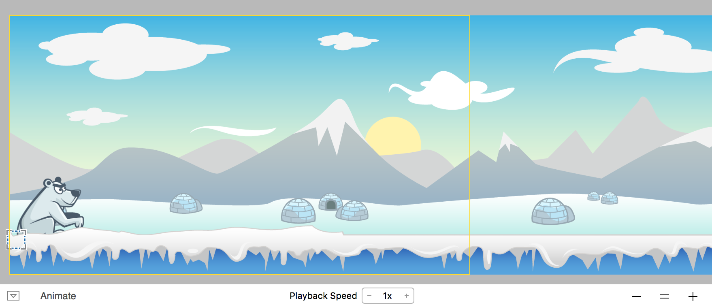
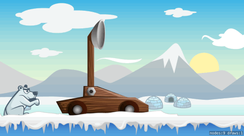

Time to grab your favorite hot beverage - let's have some fun building catapult 0.1

#Set the scene

> [action]
> Ensure the *GameScene.sks* scene *Size* is set to `(568,320)`
> Drag *background.png* onto the stage, snap to the bottom-left and set the *Z* property to `-1`
> Next drag *ground.png* onto the stage, snap to the bottom-left and set the *Z* property to `2`, we want the ground to be in the foreground as some objects such as the catapult will sit behind it.
>

Next, let's add the bear we created previously. SpriteKit lets you reference **.sks** files in other **.sks** files using a *SKReferenceNode*. This is a *super* powerful feature, and we will make extensive use of it.

> [action]
> Drag the *Bear.sks* from the *Project Navigator* onto the *GameScene.sks* and place it on the left.
> You will most likely need to do a quick *Save* to be able to see the bear sprite show up in the *SKReferenceNode*.

You should now have something that hopefully looks a lot like this:



Click on the **Animate** button to see our bear taunting.

Finally, let's build a catapult.

> [action]
> Drag *catapult.png* to the stage and set the *Z* property of *catapult.png* to `1` as we want the arm to be behind the body of the catapult.
> Drag *catapultArm.png* to the stage and set *Name* property to `catapultArm` as we will want to create a code connect for the arm.
>

Run your project....



#Prepare to fire!

Before modeling catapult physics we are going to implement a simple shooting mechanism to learn a bit more about projectile physics.

> [info]
> SpriteKit doesn't include any handy vector maths libraries out of the box, thankfully the internet will provide :]
> There is a handy collection of helper classes and functions called [SKTUtils](https://github.com/raywenderlich/SKTUtils), we've updated these to Swift 2.1 so please [Download SKTUtils.zip Here](../SKUtils.zip), unzip it and add it to your project.
>

Time to connect the catapult arm and dynamically spawn a new penguin to launch.

> [action]
> Ensure *GameScene.swift* contains the following code:
>
```
import SpriteKit
>
class GameScene: SKScene {
>    
    /* Game object connections */
    var catapultArm: SKSpriteNode!
>    
    override func didMoveToView(view: SKView) {
        /* Set reference to catapultArm node */
        catapultArm = childNodeWithName("catapultArm") as! SKSpriteNode
    }
>    
    override func touchesBegan(touches: Set<UITouch>, withEvent event: UIEvent?) {
        /* Add a new penguin to the scene */
        let penguin = MSReferenceNode(fileNamed: "Penguin")
        addChild(penguin)
>        
        /* Move penguin to the catapult bucket area */
        penguin.avatar.position = catapultArm.position + CGPoint(x: 32, y: 50)
    }
>    
    override func update(currentTime: CFTimeInterval) {
        /* Called before each frame is rendered */
    }
>    
}
>
```
>

We are creating a instance of the *Penguin.sks* using our custom *MSReferenceNode*, this simple sub class lets us access the penguin sprite inside the *Penguin.sks* throgh the *avatar* property.  We take the position of the catapultArm and add `(32,50)` to place the penguin roughly inside the catapult bucket area.

Run the project...


Great, our penguin appears then quickly falls into the abyss.
Let's add some physics to the ground to stop this, can you setup the physics body?

> [solution]
> The ground will be a static physics body and we want to ensure an accurate shape, *Alpha* is a great *Body Type* to use as it will
accurately create a body that follows the contours of the ground. Your properties should look as follows:
> 
>

Run the project again, much more fun, churn out as many penguins as you can :]

##Adding a little impulse

Let's now see how the penguin moves if we add a little impulse, imagine the penguin is being hit by a baseball bat.

> [action]
> Add the following at the end of `touchesBegan(...)`:
>
```
/* Impulse vector */
let launchDirection = CGVector(dx: 1, dy: 0)
let force = launchDirection * 400
>
/* Apply impulse to penguin */
penguin.avatar.physicsBody?.applyImpulse(force)
```
>

First we setup the force vector with a direction `(1,0)`

> [info]
> If you need a little recap on vectors, this diagram illustrates the direction of vector `(1,0)`
>
> 
>

Next we multiple this by `400` to ensure we hit the penguin with enough force to make it fly!
Please feel free to play with these values.

Run the project... Your penguins should hopefully fly across the screen :]


#Summary

You've learnt to quickly create a game scene and construct a simple catapult, even just a few lines of physics code can really
start to bring the game to life.  In the next chapter we will build our game level and load it into our *GameScene*.
