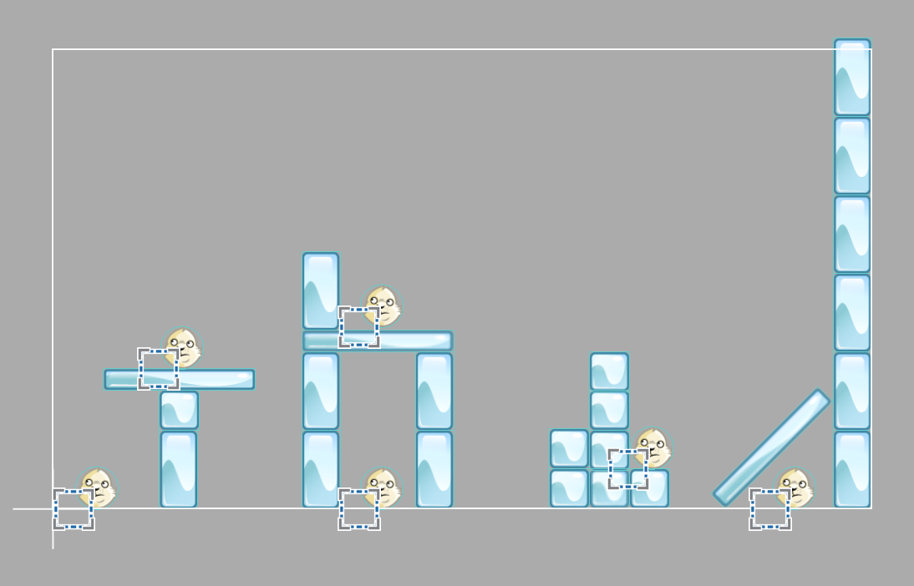
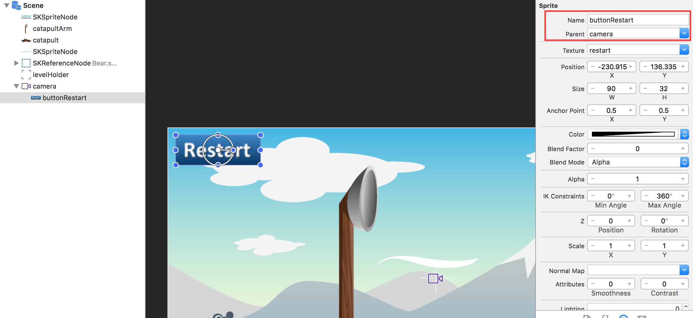

Shooting penguins is fun. Colliding with seals and ice blocks is even more fun!

Time to learn how to create and load levels.

##Set up a level loading mechanism

Now we get to solve our first little puzzle. Problem: we want to be able to have an unlimited amount of levels in our game. Therefore we don't want the game mechanics (shooting, collision detection, etc.) to be part of the levels. Otherwise we would be in big trouble if we wanted to change them -- we'd need to apply the changes to every level.

This means we are not going to add the information about a level directly to our *GameScene.sks*. A better solution is to define an area in the *GameScene.sks* that is level specific and to load the level data into that area.

##Add a Level Node

> [action]
> Drag an *Empty Node* onto your stage and set the *Position* to `(468,50)` and set the name to *levelNode*.
>
> 

This node will be the container for the levels we will be loading later on. The actual loading will happen in code, so we need to create a code connection to make the *levelNode* accessible from the *GameScene* class.

> [action]
> Create a code connection for *levelNode*
>

#Create a Level

> [action]
> In the *Project Navigator* create a *New Group* called "Levels". Inside that group create a new *SpriteKit Scene* file. Call it **Level1**.
> Set the *Size* of this scene to `(490,275)`
>

Time to build your very first level!, drag in any of the **ice block png** and your *Seal.sks* onto stage and create :]
Make sure you put something close to the left edge, that way we will be able to see a hint of the level before we implement any scrolling.

Here is one I rolled earlier:



##Add level loading code

Now we are going to add some surprisingly simple level loading code.

> [action]
> Open *GameScene.sks*
> Hopefully you managed to add the code connection for *levelNode* yourself, if not:
>
> Add this property to your class:
>
```
/* Level loader holder */
var levelNode: SKNode!
```
>
> Then in `didMoveToView(...)` add:
>
```
/* Set reference to the level loader node */
levelNode = childNodeWithName("//levelNode")
```
>
> Now to load our *Level1.sks* into the scene, add the following to the end of `didMoveToView(...)`
>
```
/* Load Level 1 */
let newLevel = SKReferenceNode(fileNamed: "Level1")
levelNode.addChild(newLevel)
```
>

This will load *level1* and add it as a child to the levelNode. When you run your game you should see your level appear in the *GameScene*:


Try and hit the ice blocks... Oh you can't as the ice blocks don't have any physics setup.  We can easily correct this, SpriteKit let's work on multiple nodes.

> [action]
> Open *Level1.sks*, hold *Shift* and select each of the ice blocks.
> Then set *Body Type* to `Bounding rectangle`, the default values are fine.

Now run the project, woo hoo you should be able to smash some blocks!

If you noticed  I added a back wall to my level and set these ice blocks to be *Static* by `unticking` the *Dynamic* property. This way the penguin will hit the static ice blocks, stopping it flying out of the level.

#Scrolling the scene

Now that we can shoot penguins, let's improve the experience by following the penguin while it flies across our level. SpriteKit features a *SKCameraNode* that let's us view our scene through this virtual camera.  However, there is no in-built functionality to follow a node so we will have to roll our own simple camera solution.

##Adding the camera

First we need to add the camera.

> [action]
> Select *GameScene.sks*
> Drag a *Camera* onto the stage, set the *Name* to the very original `camera` and set the *Position* to `283,160` which is exactly half
> the value of our scene size.

>

Great we now have a camera that by default displays the left screen of our game.  Before we can view the scene through the eye of the camera we need to assign the camera to the scene.

> [action]
> Click outside of the scene to access the scene properties and change the *camera* property to `camera`, it should be in the drop-down.
> 
>

Run your game, yeah it looks pretty much as it did before :]

##Following a node

First up we need to have a target for the camera to follow, this would be our penguin. We will add a *target* property to our *GameScene* to allow us to track a node and then add code in our `update(...)` method to update the camera's position.

> [action]
> Add the following property to our *GameScene* class:
>
```
/* Camera helpers */
var cameraTarget: SKNode?
```
> At the end of the `touchesBegan(...)` method add:
>
```
/* Set camera to follow penguin */
cameraTarget = penguin.avatar
```
>

Now that we have a target for our camera, we need to tell our camera to follow our target.

> [action]
> Add this to your `update(...)` method:
>
```
/* Check we have a valid camera target to follow */
if let cameraTarget = cameraTarget {
>
    /* Set camera postion to follow target horizontally, keep vertical locked */
    camera?.position = CGPoint(x:cameraTarget.position.x, y:camera!.position.y)
}
```
>

Run the project, the camera should now follow the penguin and you can finally see it smash the ice blocks!

##Restricting the camera movement

Something it's quite right here, why can we see outside of our game scene on both sides?

The camera tracks the penguin however it doesn't know to stop when it reaches the bounds of the scene, we can easily
improve our camera code using the *clamp* function provided in *SKTUtils*.  How do we calculate the **min** and **max** values to use?
One easy way is to simply check the default camera position in the *GameScene*, it should be (`283,160`).
This is bang in the middle of a standard single retina screen.

For the **max** you can either move the camera to see what looks like or take a more calculate approach and look at the *Size* of the background is `960` then subtract the `283` which gives us 677.

Let's add this code:

> [action]
> Add the following code after the camera position is set in `update(....)`
>
```
/* Clamp camera scrolling to our visible scene area only */
camera?.position.x.clamp(283, 677)
```
>

Run your game, should look much cleaner now :]


#Adding a level restart

Now that we can destroy the level, it also would be great to be able to restart easily. Let's add a button to reset the level.

We will implement this much like we did for the **Main Menu** using the *MSButtonNode* class.  

> [info]
> If you finding yourself needing to create buttons, I made the *restart.png* with [Da Button Factory](http://dabuttonfactory.com/)
> It was the first Google result... If you find something better, please share it.

Time to add the restart button to our *GameScene*

> [action]
> Open *GameScene.sks* and drag the *restart.png* onto stage, I would recommend putting it near the top left corner.  
> Set the *Name* to `buttonRestart` and set the *Custom Class* to `MSButtonNode`.

Run the game and you will notice the restart button is stuck to the game scene, it would be nice for the UI to sit on top of the scene so it's always accessible.  A simple way to do this is change the *Parent* property of the restart button to be `camera` then it will always be on top.



Now we need to code connect the button and add a button handler to restart the *GameScene*, can you do this yourself?
**Hint:** Look at *MainScene*

> [solution]
> Open *GameScene.sks* and add the code connection property to the *GameScene* class:
>
```
/* UI Connections */
var buttonRestart: MSButtonNode!
```
>
> Create the connection in `didMoveToView(...)`
>
```
/* Set UI connections */
buttonRestart = childNodeWithName("//buttonRestart") as! MSButtonNode
```
>
> Setup the handler to restart the *GameScene* in `didMoveToView(...)`
>
```
/* Setup restart button selection handler */
buttonRestart.selectedHandler = {
>
/* Grab reference to our SpriteKit view */
let skView = self.view as SKView!
>
/* Load Game scene */
let scene = GameScene(fileNamed:"GameScene") as GameScene!
>
/* Ensure correct aspect mode */
scene.scaleMode = .AspectFill
>
/* Show debug */
skView.showsPhysics = true
skView.showsDrawCount = true
skView.showsFPS = false
>
/* Restart game scene */
skView.presentScene(scene)
}
```
>

Great! Now run the game and make use of the new **"Restart"** button.

#Summary

Congrats! This is starting to look like an actual game. In the next chapter you are going to learn how to implement a great, physics based shooting mechanism, so stay tuned!
