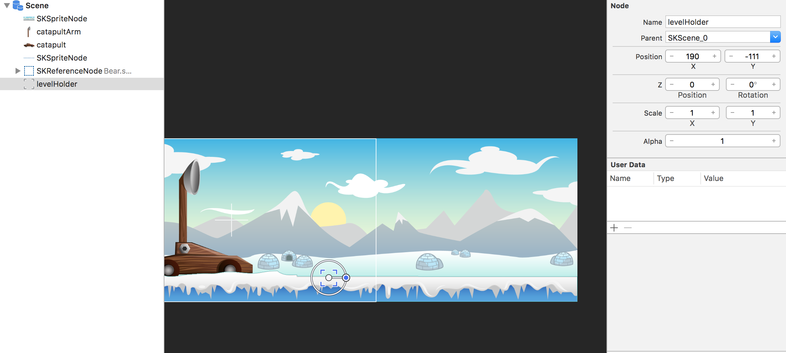
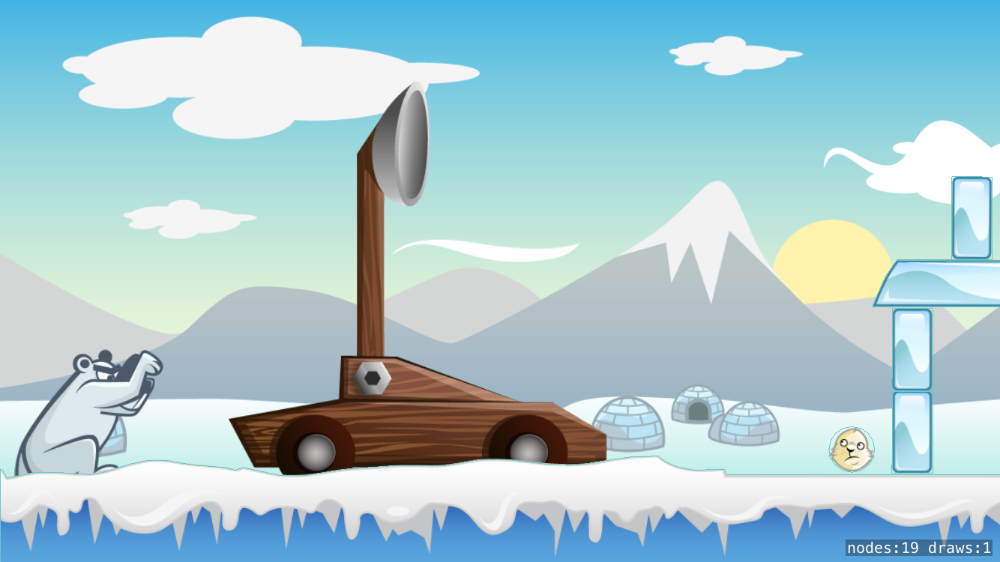
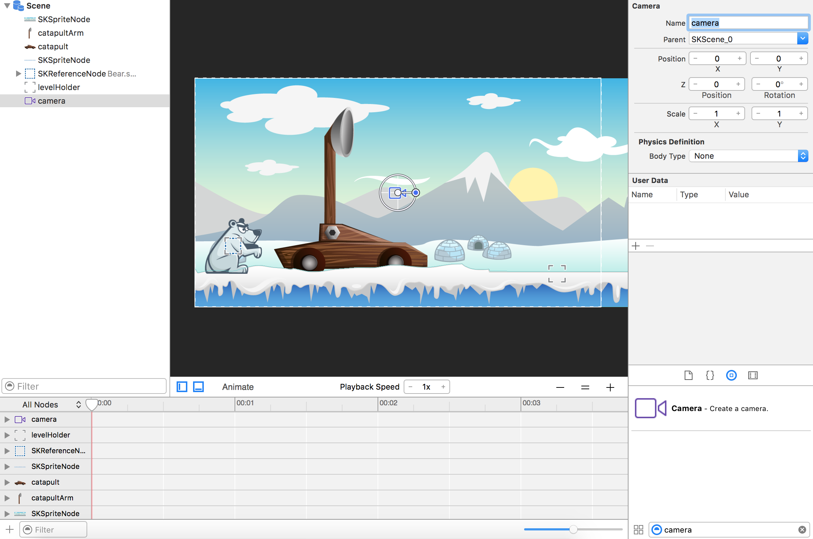
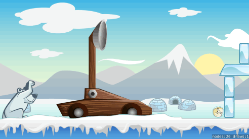

Launching penguins is fun.  However, colliding with seals and ice blocks is a game!
Time to design the first level.

#Level loading mechanism

Now let's solve our first little puzzle. Problem: You want to be able to have an unlimited amount of levels in your game. Therefore you don't want the game mechanics (shooting, collision detection, etc.) to be part of the levels itself.  Otherwise you would be in big trouble if you wanted to change them -- you would need to apply the changes to every level. Which is possible just not very sensible :]

This means your are not going to add the information about a level directly to your *GameScene.sks*. A better solution is to define an area in the *GameScene.sks* that is level specific and load the level data into that area.

##Add a level node

> [action]
> Drag an *Empty Node* onto your stage and set *Position* to `(468,50)` and set *Name* to `levelNode`.
>
> 

This node will be the container for the levels you will be loading later on. The actual loading mechanism will happen in code, you will we need to create a code connection to make the **levelNode** accessible from the *GameScene* class.

You should be quite familiar with this process by now.

> [action]
> Create a code connection for the *levelNode*
>

#Designing a level

> [action]
> In *Project Navigator* create a *New Group* called **"Levels"**. Inside that group create a new *SpriteKit Scene* file, save it as `Level1.sks`
> Set *Size* to `(490,275)`
>

Time to design your very first level!, drag in any of the **ice block png** and your *Seal* onto stage and create :]

> [info]
> Design tip: make sure you put something close to the left edge, that way the player will be able to see a hint of the level.

Here is one I made earlier:


#Level loading code

Now you are going to add some simple level loading code.

> [action]
> Open *GameScene.swift*
> If you had any issue creating the `levelNode` code connection, here is a recap:
>
> Add this property to your class:
>
```
/* Level loader holder */
var levelNode: SKNode!
```
>
> Add the following to the `didMoveToView(...)` method:
>
```
/* Set reference to the level loader node */
levelNode = childNodeWithName("//levelNode")
```
>

<!-- -->

> To load your level scene into the *GameScene*, add the following to the end of `didMoveToView(...)`:
>
```
/* Load Level 1 */
let resourcePath = NSBundle.mainBundle().pathForResource("Level1", ofType: "sks")
let newLevel = SKReferenceNode (URL: NSURL (fileURLWithPath: resourcePath!))
levelNode.addChild(newLevel)
```
>

This will load the *Level1.sks* scene and add it as a reference node to the levelNode.

Run your game... You should see a hint of your level if you put an object near the left edge of *Level1*.



##Hit the ice

Try and hit the ice blocks...

Oh no, you can't as the ice blocks don't have physics bodies.  SpriteKit lets you work on multiple nodes which makes this task even easier.

> [action]
> Open *Level1.sks*, hold *cmd* and *drag* a selection box across the scene.
> To deselect the seals, you can then hold *shift* and click on the corner of each seal carefully.
>
> Set *Body Type* to `Bounding rectangle`, all the default values are fine.

Run your game, woo hoo you should be able to knock over the ice blocks!

> [info]
> Tip: If you noticed in my example level design, I added a back wall to my level and set these ice blocks to be *Static* by `unchecking` the *Dynamic* property. This way the penguin will hit the static ice blocks, blocking the penguin from flying out of the game world.

#Scrolling the scene

Now that you can shoot penguins, let's improve the experience by tracking the penguin in flight across the level. SpriteKit features a *SKCameraNode* that lets you view the scene through this virtual camera.  However, as it stands there is no in-built functionality to follow a node so you are going to have to build your node tracking solution.

##Add the camera

First you need to add the *SKCameraNode* to the scene.

> [action]
> Open *GameScene.sks*, drag a *Camera* onto the stage, set *Name* to the highly original `camera` and set *Position* to `(283,160)` which is exactly half the value of your scene size.
> 
>

Great, you now have a camera that by default displays the left side of the game scene.  Before you can view the scene through the eye of the camera, you need to assign the camera to the scene.

> [action]
> Select your *GameScene* and set *camera* to `camera`, it should be available in the drop-down.
> 
>

Run your game... So yeah it looks pretty much the same :]

##Tracking a node

First up you need to have a target for the camera to follow, this would be the penguin. You will be adding a *target* property to the *GameScene*  class to allow you to track a node and then modify the `update(...)` method to update the camera's position.

> [action]
> Add the following property to your *GameScene* class:
>
```
/* Camera helpers */
var cameraTarget: SKNode?
```
> At the end of the `touchesBegan(...)` method add:
>
```
/* Set camera to follow penguin */
cameraTarget = penguin.avatar
```
>

Now that you have a target for the camera, you need to update the camera's position to follow the target.

> [action]
> Add this to your `update(...)` method:
>
```
/* Check we have a valid camera target to follow */
if let cameraTarget = cameraTarget {
>
    /* Set camera position to follow target horizontally, keep vertical locked */
    camera?.position = CGPoint(x:cameraTarget.position.x, y:camera!.position.y)
}
```
>

Run your game... The camera should now follow the penguin and you can finally see the ice block smashing action for yourself.

##Restricting the camera movement

Something isn't quite right here, why does the camera go outside of the game scene?

Although the camera tracks the penguin however it doesn't know to stop when it reaches the bounds of the scene, you are going to improve the camera code using the *clamp* function provided in *SKTUtils*.  
How do you calculate the **min** and **max** values to use?

A simply way to find the **min** is look at the current default camera position in the *GameScene*, it should be `(283,160)`.

For the **max** you can either move the camera in *GameScene.sks* to see what value makes sense or take a more calculated approach and take the *Size* of the background, which is`960` then subtract the `283` which gives you `677`.

Let's apply this:

> [action]
> Add the following code after the camera position update in `update(....)`
>
```
/* Clamp camera scrolling to our visible scene area only */
camera?.position.x.clamp(283, 677)
```
>

Run your game... It should hopefully look like this:



#Restarting the level

Now that the player can demolish a level, it also would be great for them to be able to restart the game. Let's add a button to reset the level.

You will implement this much like we did for the **Main Menu** using the *MSButtonNode* class.  

> [info]
> If you finding yourself needing to create button graphics, I made the *restart.png* with aptly titled [Da Button Factory](http://dabuttonfactory.com/)
> If you find something even better, please share it.

Let's add the restart button to the *GameScene*

> [action]
> Open *GameScene.sks* and drag the *restart.png* onto stage. I would recommend putting it near the top left corner.
> Set *Name* to `buttonRestart` and set *Custom Class* to `MSButtonNode`.

Run your game... You will notice the restart button is stuck to the game scene, it would be nice for the UI to sit on top of the scene so it's always accessible no matter where the camera is.

> [action]
> Select the **restart button** and set *Parent* to `camera`.


Next you need to code connect the button and add a **selectedhandler** to restart the *GameScene*, can you do this yourself?

**Hint:** Look at the *MainScene* button implementation.

> [solution]
> Open *GameScene.sks* and add the code connection property to the *GameScene* class:
>
```
/* UI Connections */
var buttonRestart: MSButtonNode!
```
>
> Add the connection to the `didMoveToView(...)`:
>
```
/* Set UI connections */
buttonRestart = childNodeWithName("//buttonRestart") as! MSButtonNode
```
>
> Add the selectedhandler to restart the *GameScene* in `didMoveToView(...)`:
>
```
/* Setup restart button selection handler */
buttonRestart.selectedHandler = {
>
/* Grab reference to our SpriteKit view */
let skView = self.view as SKView!
>
/* Load Game scene */
let scene = GameScene(fileNamed:"GameScene") as GameScene!
>
/* Ensure correct aspect mode */
scene.scaleMode = .AspectFill
>
/* Show debug */
skView.showsPhysics = true
skView.showsDrawCount = true
skView.showsFPS = false
>
/* Restart game scene */
skView.presentScene(scene)
}
```
>

Great!

Run your game... Your **Restart button** should be fully operational.

#Summary

Congrats! This is starting to look like an actual game.
You learnt to:

- Build a dynamic level loading mechanism
- Design your first level
- Using *SKCameraNode* and tracking a node
- Adding a restart button

In the next chapter you are going to learn how to take the physics to the next level and model a catapult.
