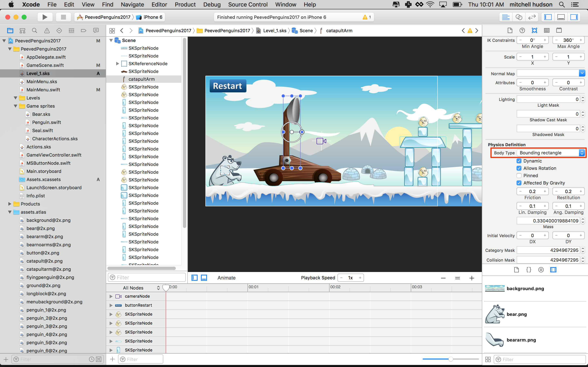
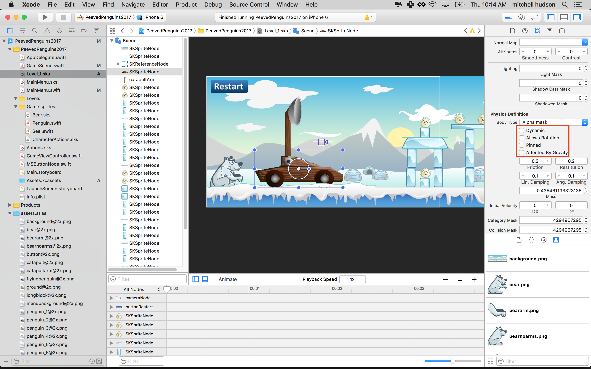
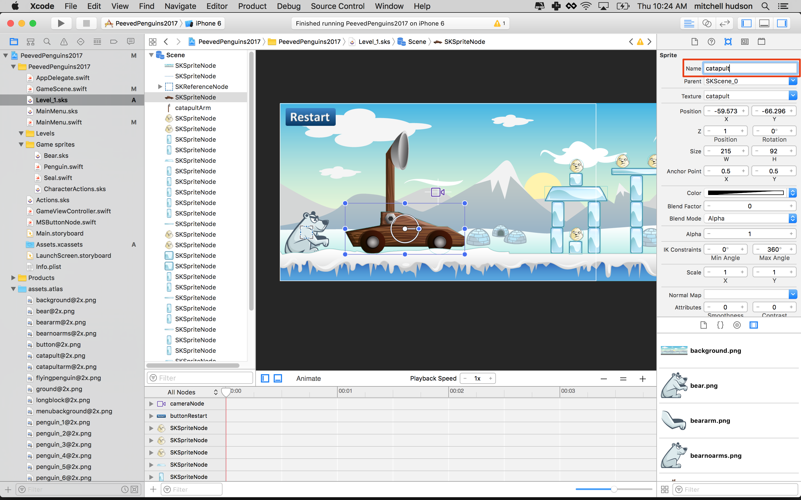
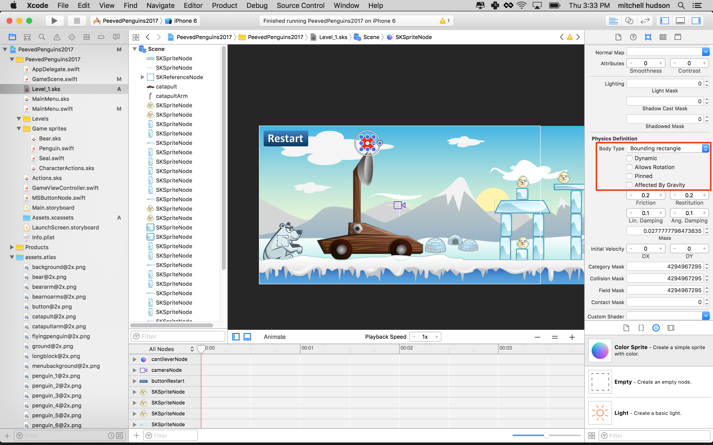

Now things are going to get real. You are going to implement a physics based shooting 
mechanic. First let's get started with a short introduction to some of the physics 
objects you will be using.

**Physics Joints**

Physics joints create relationships between objects that simulate The physical connections
that objects have in the real world. With them you can simulate things like wheels that 
turn, and objects connected with springs or ropes. Here are the joints that SpriteKit 
supports:

- Spring
- Limit
- Pin
- Fixed
- Sliding

You will use a pin joint to create a hinge point for the catapult arm. Then you will use 
spring to make the catapult fling a Penguin.  

# Physics joints

In this step you're going to turn the catapult and the catapult arm into physics objects. 
Unlike the other physics objects in our game, the catapult consists of two parts that 
you will join together. Two physics objects can be connected to each other using *joints*.

Try it out for yourself. 

> [action]
<<<<<<< HEAD
> Open *Level_1.sks* select the *catapultArm* and look for *Physics Definition* and set 
> the *Body Type* to *Bounding Rectangle*. 
=======
> Open *GameScene.sks* and enable physics on the **catapult** and **catapultArm** . Set *Body Type* to `Alpha mask`.
>>>>>>> MakeSchool-Tutorials/master
>

While the shape of the arm is not exactly a rectangle, the shape is close to a rectangle. 
Using a rectangle will be more efficient give better performance. 

> [action]
> Next, select the catapult body and look for *Physics Definition* and set the *Body Type*
> to *Alpha Mask*. 

In this case the physics shape follow the outline of the texture/image. This is less 
effcient but will look better if a Penguin or Seal flies back and hits the catapult. 



Run your game...


The catapult falls apart because you're not using joints to keep it connected!
The bodies are also Dynamic, the default setting. Dynamic bodies can not over lap and
are effected by gravity. 

# Getting the physics bodies ready

Let's revise the physics bodies.

> [action]
> Select the *catapult* (Not the Arm)
> Uncheck:

- `Dynamic`
- `Allows Rotation` 
- `Affected By Gravity`



<<<<<<< HEAD
You need a reference to both the *catapult* and the *catapultArm* to set up the joint.

> [action]
> Make sure you have a reference to both *catapult* and *catapultArm* at the top of 
> *GameScene.swift* 
=======
You already have a code connection for the **catapultArm**, can you code connect the **catapult** as well?

> [action]
> Try and create a code connection for the `catapult`.
>
> Remember to set the *Name*, a sensible value would be `catapult`

Next you are going to manually setup the *Physics Body* for the **catapultArm**.

> [action]
> Add the following to `didMoveToView(...)` after the level loading code.
>
```
/* Create catapult arm physics body of type alpha */
let catapultArmBody = SKPhysicsBody (texture: catapultArm!.texture!, size: catapultArm.size)
>
/* Set mass, needs to be heavy enough to hit the penguin with solid force */
catapultArmBody.mass = 0.5
>
/* Apply gravity to catapultArm */
catapultArmBody.affectedByGravity = true
>
/* Improves physics collision handling of fast moving objects */
catapultArmBody.usesPreciseCollisionDetection = true
>
/* Assign the physics body to the catapult arm */
catapultArm.physicsBody = catapultArmBody
```
>
>>>>>>> MakeSchool-Tutorials/master

You already have a code connection for the **catapultArm**, can you connect the 
**catapult** as well. Remember to set the *Name*, a sensible value would be `catapult`.



> [action] 
> Add a variable to reference the catapult. Add this line to the top of your `GameScene`
> class:
>
> `var catapult: SKSpriteNode!`
> 
> Then add the following near the top of `didMove(to view:)`
> 
> `catapult = childNode(withName: "catapult") as! SKSpriteNode`
>

<<<<<<< HEAD
# Creating a Physics body and a joint
=======
#Your first joint
>>>>>>> MakeSchool-Tutorials/master

Next you are going to manually setup the *Physics Body* for the **catapultArm**. Your 
code is getting pretty long, it's a good idea to organize code into functions. 

> [action]
<<<<<<< HEAD
> Add this method to the `GameScene` class.  
=======
> Add the following to the end of your `didMoveToView(...)` method:
>>>>>>> MakeSchool-Tutorials/master
>
```
func setupCatapult() {
    /* Pin joint */
    var pinLocation = catapultArm.position
    pinLocation.x += -10
    pinLocation.y += -70
    let catapultJoint = SKPhysicsJointPin.joint(
        withBodyA:catapult.physicsBody!,
        bodyB: catapultArm.physicsBody!,
        anchor: pinLocation)
    physicsWorld.add(catapultJoint)
}
```
>
> Call the new function at the end of `didMove(to view:)`.
> 
> `setupCatapult()`
>

> [info]
> *Remember* Apple documentation is your friend, if you are unsure of anything, 
> highlight the method or property in question and look at the *Quick Help* description.
>

## Springing into action

You need a joint that will simulate the action of a catapult, allowing the player to 
pull back on the bucket and launch **spring** forward, *SKPhysicsJointSpring* sounds 
like it was made for this job!

Before you setup this joint, it's important to note that joints always require two bodies. 
In this case you don't have another body to connect to.

It's common practice to create invisible static physics bodies to serve this purpose, 
you can use Scene Editor to create an invisible color sprite and set it up with a 
static physics body.  This will then be used to provide the second body for the joint.

> [action]
> Open *Level_1.sks*
> Drag a *Color Sprite* onto the stage and place it above the catapult arm.
> Set *Name* to `cantileverNode` (check fancy catapult design terminology) :]
> Although you don't want this sprite to be visible to the player, for now just 
> adjust the *Size* to `(25,25)` and leave it visible it's easier for you to work 
> and debug with.
>

>
> Next, set the *physics body* to *Bounding Rectangle*, then *uncheck*: Dynamic, 
> Allows Rotation, and Affected by Gravity.
>

>
> It's important that this node does not collide with any other physics objects, you 
> wouldn't want the penguin to accidentally hit this invisible node and fall to the ground.  
> Even if a node is visually invisible, the physics body is still part of the physics 
> simulation and will react to collisions, unless setup otherwise.
> Set both *Category Mask* and *Collison Mask* to `0`.
>

>

Next you need to add a code connection for this node.

> [action]
> Add a code connection for the `cantileverNode` yourself.

Time to finally join these bodies together using a *SKPhysicsJointSpring*.

> [action]
> Add the following at the end of `setupCatapult()`
>
```
/* Spring joint catapult arm and cantilever node */
<<<<<<< HEAD
var anchorAPosition = catapultArm.position
anchorAPosition.x += 0
anchorAPosition.y += 50
let catapultSpringJoint = SKPhysicsJointSpring.joint(withBodyA: catapultArm.physicsBody!, bodyB: cantileverNode.physicsBody!, anchorA: anchorAPosition, anchorB: cantileverNode.position)
physicsWorld.add(catapultSpringJoint)
catapultSpringJoint.frequency = 6
catapultSpringJoint.damping = 0.5
=======
let catapultSpringJoint = SKPhysicsJointSpring.jointWithBodyA(catapultArm.physicsBody!, bodyB: cantileverNode.physicsBody!, anchorA: catapultArm.position + CGPoint(x:15, y:30), anchorB: cantileverNode.position)
physicsWorld.addJoint(catapultSpringJoint)
>
/* Make this joint a bit more springy */
catapultSpringJoint.frequency = 1.5
>>>>>>> MakeSchool-Tutorials/master
```
>

Here you created a CGPoint to locate the position where the spring will attach to the 
catapult arm. Then created a *spring joint*. After that you added the spring to the 
physics world. Last you set some properties of the spring (frequency, damping). These
determine the qualities of the spring. You may want to come back and edit these numbers to 
adjust the catapult action when the game is finished. 

Run your game... **Notice:** the faint blue lines showing the connection between our 
two bodies? This is because we added the physics debug flag when launching the 
*GameScene*, this is really handy when developing more complex physics models.


# Pulling the catapult arm

Great, you have a **catapultArm** with a spring joint attached to the static 
**cantileverNode**. How will the player pull the **catapultArm** back to create this 
force in the spring joint ready to be unleashed upon the penguin?

## Dragging concept

Here's a short outline of what you are going to do:

- If the player starts touching the **catapultArm**, you will create a **springJoint** 
between a **touchNode** and the **catapultArm**
- Whenever the touch moves, you update the position of the **touchNode**
- When the touch ends you destroy the joint between the **touchNode** and the 
**catapultArm** so the **catapultArm** snaps back to it's original position and fires 
the penguin into the air

It's often easier to understand when you see physics in action, there's a lot going on 
here so make sure you pay extra attention. As I'm sure you already were :]

## Adding the touchNode

> [action]
> The quickest way to create the *touchNode* is to *Copy* & *Paste* the **cantileverNode** 
> and rename it to **touchNode** and place it behind the catapult arm.
>
> 
>

The *touchNode* will require a code connection.

> [action]
> Add the code to connect the *touchNode* yourself.

Let's double check the code connections so far in this section:

> [action]
> Ensure your *GameScene* class properties include:
>
```
var catapultArm: SKSpriteNode!
var catapult: SKSpriteNode!
var cantileverNode: SKSpriteNode!
var touchNode: SKSpriteNode!
```
>
> Check the subsequent code connections in `didMove(to view:)` you should have these
> connections: 
```
/* Set reference to catapultArm node */
catapultArm = childNode(withName: "catapultArm") as! SKSpriteNode
catapult = childNode(withName: "catapult") as! SKSpriteNode
cantileverNode = childNode(withName: "cantileverNode") as! SKSpriteNode
touchNode = childNode(withName: "touchNode") as! SKSpriteNode
```
>

## Dynamic joints

<<<<<<< HEAD
Next up you will be dynamically creating a sprint joint whenever the player touches the 
catapult arm to initiate pulling back the catapult.  It needs to be accessible to your 
class as when the player lets go of the catapult arm you need to destroy the joint, 
which in turn releases the catapult arm and sets everything in motion.
=======
Next up you will be dynamically creating a spring joint whenever the player touches the catapult arm to initiate pulling back the catapult. It needs to be accessible to your class so that when the player lets go of the catapult arm you can destroy the joint, which in turn releases the catapult arm and sets everything in motion.
>>>>>>> MakeSchool-Tutorials/master

> [action]
> Add this property to the *GameScene* class:
>
```
/* Physics helpers */
var touchJoint: SKPhysicsJointSpring?
```
>

This property will contain a physics joint when the catapult arm is being dragged. When 
the arm is release the joint is removed. 

While you are focusing on modeling the catapult physics, let's park the penguin launching 
code for later.

# Touch control

> [action]
> _Replace_ the existing `touchBegan(_ touches: with event:)` method with:
>
```
override func touchesBegan(_ touches: Set<UITouch>, with event: UIEvent?) {
    /* Called when a touch begins */
    let touch = touches.first!              // Get the first touch
    let location = touch.location(in: self) // Find the location of that touch in this view
    let nodeAtPoint = atPoint(location)     // Find the node at that location
    if nodeAtPoint.name == "catapultArm" {  // If the touched node is named "catapultArm" do...
        touchNode.position = location
        touchJoint = SKPhysicsJointSpring.joint(withBodyA: touchNode.physicsBody!, bodyB: catapultArm.physicsBody!, anchorA: location, anchorB: location)
        physicsWorld.add(touchJoint!)
    }
}
```
>

When the player touches the **catapult arm**, the **touchNode** will set the touch 
position and the *SKPhysicsJointSpring* will be created between the **touchNode** and the 
**catapultArm** to create the pullback mechanic.

**At this point you still can't pull back the catapult just yet.** The 
`touchBegan(_ touches: with event:)` occurs when your finger touches the screen. 
It's doesn't keep track as your finger move across the screen, for this you'll 
`touchMoved(_ touches: with event:)`.

## Lean back

To pull the catapult arm you need the **touchNode** to track the player's touch.  You 
can add this by implementing the *touchedMoved* method.

> [action]
> Add the following method to the *GameScene* class:
>
```
override func touchesMoved(_ touches: Set<UITouch>, with event: UIEvent?) {
    let touch = touches.first!
    let location = touch.location(in: self)
    touchNode.position = location
}
```
>

Great you can now pull back the catapult, remember to touch and drag from the **catapult
arm!** Touching the "touch node" will have no effect. The touch node is a just a helper 
object. 

There is one last step required to 'spring it to life'. Once the player releases 
their touch, you need to sever the **touchJoint**. This will release the joint 
holding the catapult arm and **touchNode**, allowing the forced stored in the 
**cantileverNode** spring joint to exert its force.

## Let it go

To facilitate this joint removal you will be implementing the *touchesEnded* method.

> [action]
> Add this method to your *GameScene* class
>
```
override func touchesEnded(_ touches: Set<UITouch>, with event: UIEvent?) {
    if let touchJoint = touchJoint {
        physicsWorld.remove(touchJoint)
    }
}
```
>

Run your game... You should have a working catapult model, a massive improvement on 
the original launcher :]


> [info]
> Performance in the iOS simulator is not as good as it is on a real device. 
> 

# Summary

Great! Now you are really close to completing the shooting mechanism. You've covered a 
lot of ground here, don't worry if you don't 'get it' straight away.  The best way to 
get more familiar with game physics is to experiment, experiment, experiment.

You've learnt to:

- Use *SKPhysicsJointPin* to stick bodies together
- Use *SKPhysicsJointSpring* to create tension between physics bodies
- Add static physics bodies to facilitate complex joint connections
- Dynamic joint creation
- Touch mechanics

In the next chapter you will be adding the penguin to catapult.
