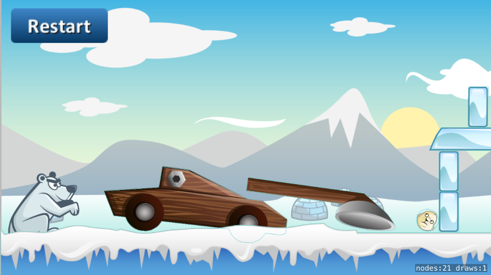
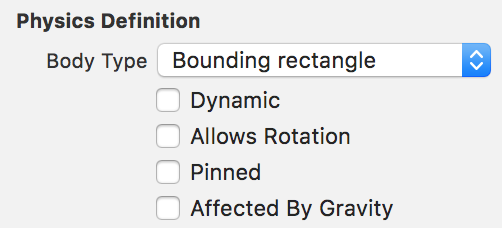

Now things are going to get real. You are going to implement a physics based shooting mechanic. First let's get started with a short introduction to some of the physics objects you will be using.

#Physics joints

In this step you're going to turn the catapult and the catapult arm into physic objects. Unlike the other physics objects you have in our game at the moment, the catapult consists of two parts that you will want to join.  Two physics objects can be connected to each other using joints.

Don't understand why you need joints yet? Let's try it out.

> [action]
> Open *GameScene.sks* and enable physics on the **catapult** and **catapult** . Set *Body Type* to `Alpha mask`.
>

Run your game...



The catapult falls apart because you're not using joints to keep it connected!

#Getting the physics bodies ready

Let's revise the physics bodies.

> [action]
> Select the *catapult* (Not the Arm)
> Uncheck -`Dynamic`, `Allows Rotation` and `Affected By Gravity`.

Next you will remove the physics body from the catapult Arm as you will be learning how to implement a physics body in code.

> [action]
> Select the *catapultArm*
> Set *Body Type* to `None` to remove physics.
>

There is sadly no support to visually create joints in the *GameScene* so you will have to code all of this. However, you can use the Scene Editor to create all of the physics bodies that will be connected.  Before you do this you need access to the **catapult** and **catapultArm**.

You already have a code connection for the **catapultArm**, can you connect the **catapult** as well. Remember to set the *Name*, a sensible value would be `catapult`.

Next you are going to manually setup the *Physics Body* for the **catapultArm**.

> [action]
> Add the following to `didMoveToView(...)` after the level loading code.
>
```
/* Create catapult arm physics body of type alpha */
let catapultArmBody = SKPhysicsBody (texture: catapultArm!.texture!, size: catapultArm.size)
>
/* Set mass, needs to be heavy enough to hit the penguin with solid force */
catapultArmBody.mass = 0.5
>
/* No need for gravity otherwise the arm will fall over */
catapultArmBody.affectedByGravity = true
>
/* Improves physics collision handling of fast moving objects */
catapultArmBody.usesPreciseCollisionDetection = true
>
/* Assign the physics body to the catapult arm */
catapultArm.physicsBody = catapultArmBody
```
>

<!-- -->

> [info]
> *Remember* Apple documentation is your friend, if you are unsure of anything, highlight the method or property in question and look at the *Quick Help* description.
>

Run your game... The **catapultArm** simply falls over :[

#Dat first joint :]

Now time to create your first joint, you will be using *SKPhysicsJointPin* to connect the **catapult** and **catapultArm** together.

> [action]
> Add the following to the end of your `didMoveToView(...)` method:
```
/* Pin joint catapult and catapult arm */
let catapultPinJoint = SKPhysicsJointPin.jointWithBodyA(catapult.physicsBody!, bodyB: catapultArm.physicsBody!, anchor: CGPoint(x:220 ,y:105))
physicsWorld.addJoint(catapultPinJoint)
```
>

The *anchor* is relative to scene, so you need to find the **position** in scene space of the ideal pivot point on the catapult. An easy way to do this is add a temp sprite to the scene and move it to the position you want to anchor on, use that position value and then remove the temp sprite from the scene.

Now you have set up your first joint! Run the game...  

The **catapultArm** should gracefully fall over while pinned to the catapult, although if you touch the screen, launching penguins is now rather odd :]

##Springing into action

You need a joint that will simulate the action of a catapult, allowing the player to pull back on the bucket and launch **spring** forward.

*SKPhysicsJointSpring* sounds like it was made for this job, as the spring length is extended by pulling back on the catapultArm the more force will be required to bring the bodies back together, when released the spring joint will snap the **catapultArm** back quickly.

Before you setup this joint, it's important to note that joints always require two bodies.  In this case you don't have another body to connect to. There is a solution...

It's common practice to create invisible static physics bodies to serve this purpose, you can use Scene Editor to create an invisible color sprite and set it up with a static physics body.  This will then be used to provide the second body for the joint.

> [action]
> Drag a *Color Sprite* onto the stage and place it above the catapult arm.
> Set *Name* to `cantileverNode` (check fancy catapult design terminology) :]
> Although you don't want this sprite to be visible to the player, for now just adjust the *Size* to `(25,25)` and leave it visible it's easier for you to work and debug with.
>

>
Ensure this node's physic body is static by `unchecking` *Dynamic*.
>

>
> It's important that this node does not collide with any other physics objects, you wouldn't want the penguin to accidentally hit this invisible node and fall to the ground.  Even if a node is visually invisible, the physics body is still part of the physics simulation and will react to collisions, unless setup otherwise.
> Set both *Category Mask* and *Collison Mask* to `0`.

Next you need to add a code connection for this node.

> [action]
> Please add a code connection for the `cantileverNode` yourself.

Time to finally join these bodies together using a *SKPhysicsJointSpring*.

> [action]
> Add the following code after the first pin joint setup in `didMoveToView(...)`
>
```
/* Spring joint catapult arm and cantilever node */
let catapultSpringJoint = SKPhysicsJointSpring.jointWithBodyA(catapultArm.physicsBody!, bodyB: cantileverNode.physicsBody!, anchorA: catapultArm.position + CGPoint(x:15, y:30), anchorB: cantileverNode.position)
physicsWorld.addJoint(catapultSpringJoint)
```
>

Run your game... The **catapultArm** should be standing to attention.


**Notice:** the faint blue lines showing the connection between our two bodies? This is because we added the physics debug flag when launching the *GameScene*, this is really handy when developing more complex physics models.

#Pulling the catapult arm

Great, you have a **catapultArm** with a spring joint attached to the static **cantileverNode**.  
How will the player pull the **catapultArm** back to create this force in the spring joint ready to be unleashed upon the penguin?

##Dragging concept

Here's a short outline of what you are going to do:

- If the player starts touching the **catapultArm**, you will create a **springJoint** between a **touchNode** and the **catapultArm**
- Whenever the touch moves, you update the position of the **touchNode**
- When the touch ends you destroy the joint between the **touchNode** and the **catapultArm** so the **catapultArm** snaps back to it's original position and fires the penguin into the air

It's often easier to understand when you see physics in action, there's a lot going on here so make sure you pay extra attention. As I'm sure you already were :]

##Adding the touchNode

> [action]
The quickest way to create the *touchNode* is to *Copy* & *Paste* the **cantileverNode** and rename it to **touchNode** and place it behind the catapult arm.
>
> 
>

The *touchNode* will require a code connection.

> [action]
> Please code connect the *touchNode* yourself.

In case you want to double or triple check your code connections so far in this section:

> [action]
> Ensure your *GameScene* class properties include:
>
```
var catapultArm: SKSpriteNode!
var catapult: SKSpriteNode!
var cantileverNode: SKSpriteNode!
var touchNode: SKSpriteNode!
```
>
> Check the subsequent code connections in `didMoveToView(...)`:
>
```
catapultArm = childNodeWithName("catapultArm") as! SKSpriteNode
catapult = childNodeWithName("catapult") as! SKSpriteNode
cantileverNode = childNodeWithName("cantileverNode") as! SKSpriteNode
touchNode = childNodeWithName("touchNode") as! SKSpriteNode
```
>

##Dynamic joints

Next up you will be dynamically creating a sprint joint whenever the player touches the catapult arm to initiate pulling back the catapult.  It needs to be accessible to your class as when the player lets go of the catapult arm you need to destroy the joint, which in turn releases the catapult arm and sets everything in motion.

> [action]
> Add this property to the *GameScene* class:
>
```
/* Physics helpers */
var touchJoint: SKPhysicsJointSpring?
```
>

While you are focusing on modeling the catapult physics, let's park the penguin launching code for later.

#Touch control

> [action]
> Replace the existing `touchBegan(...)` method with:
>
```
override func touchesBegan(touches: Set<UITouch>, withEvent event: UIEvent?) {
    /* Called when a touch begins */
>    
    /* There will only be one touch as multi touch is not enabled by default */
    for touch in touches {
>        
        /* Grab scene position of touch */
        let location    = touch.locationInNode(self)
>        
        /* Get node reference if we're touching a node */
        let touchedNode = nodeAtPoint(location)
>        
        /* Is it the catapult arm? */
        if touchedNode.name == "catapultArm" {
>            
            /* Reset touch node position */
            touchNode.position = location
>            
            /* Spring joint touch node and catapult arm */
            touchJoint = SKPhysicsJointSpring.jointWithBodyA(touchNode.physicsBody!, bodyB: catapultArm.physicsBody!, anchorA: location, anchorB: location)
            physicsWorld.addJoint(touchJoint!)
>            
        }
    }
}
```
>

When the player touches the screen, the **touchNode** will be set the touch position and the *SKPhysicsJointSpring* will be created between the **touchNode** and the **catapultArm** to create the pullback mechanic.

Run your game...

The **touchNode** should move to the position the player touches.  However, the player can't pull back the catapult just yet.

##Lean back

To pull the catapult arm you need the **touchNode** to track the player's touch.  You can add this by implementing the *touchedMoved* method.

> [action]
> Add the following method to the *GameScene* class:
>
```
override func touchesMoved(touches: Set<UITouch>, withEvent event: UIEvent?) {
    /* Called when a touch moved */
>    
    /* There will only be one touch as multi touch is not enabled by default */
    for touch in touches {
>        
      /* Grab scene position of touch and update touchNode position */
      let location       = touch.locationInNode(self)
      touchNode.position = location
>        
    }
}
```
>

Great you can now pull back the catapult, there is one last step required to 'spring it to life'.  Once the player releases their touch, you need to sever the **touchJoint**.  This will release the joint holding the catapult arm and **touchNode**, allowing the forced stored in the **cantileverNode** spring joint to exert its force.

##Let it go

To facilitate this joint removal you will be implementing the *touchesEnded* method.

> [action]
> Add this method to your *GameScene* class
>
```
override func touchesEnded(touches: Set<UITouch>, withEvent event: UIEvent?) {
    /* Called when a touch ended */
>        
    /* Let it fly!, remove joints used in catapult launch */
    if let touchJoint = touchJoint { physicsWorld.removeJoint(touchJoint) }
}
```
>

Run your game... You should have a working catapult model, a massive improvement on the original launcher :]


> [info]
> It's important to run physics based games on device, simulator performance can be bad and this will really affect the physics simulation. So always test on device (if you can).
>

#Summary

Great! Now you are really close to completing the shooting mechanism. You've covered a lot of ground here, don't worry if you don't 'get it' straight away.  The best way to get more familiar with game physics is to experiment, experiment, experiment.

You've learnt to:

- Use *SKPhysicsJointPin* to stick bodies together
- Use *SKPhysicsJointSpring* to create tension between physics bodies
- Add static physics bodies to facilitate complex joint connections
- Dynamic joint creation
- Touch mechanics

In the next chapter you will be adding the penguin to catapult.
